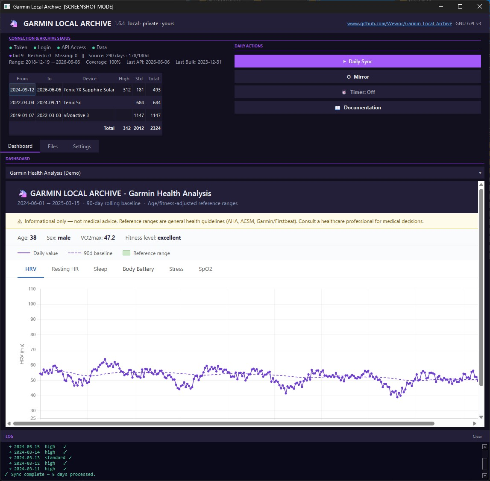
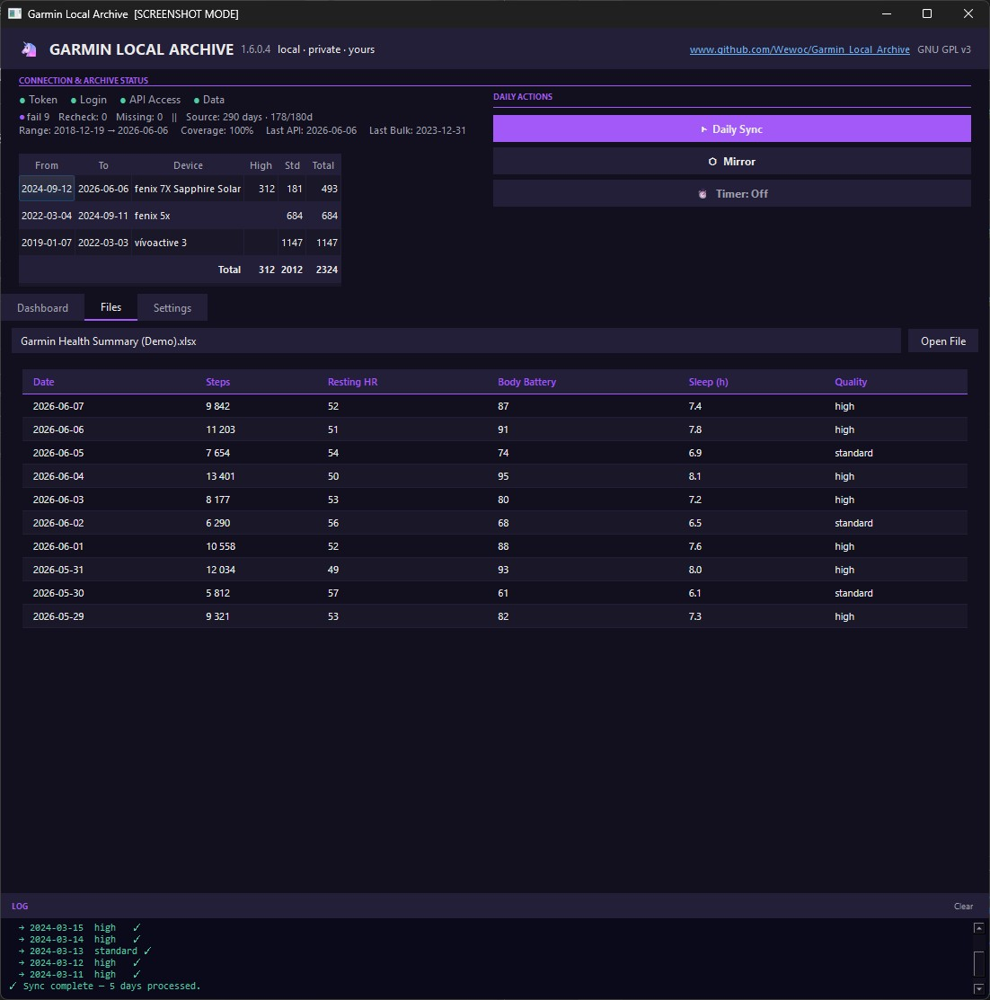
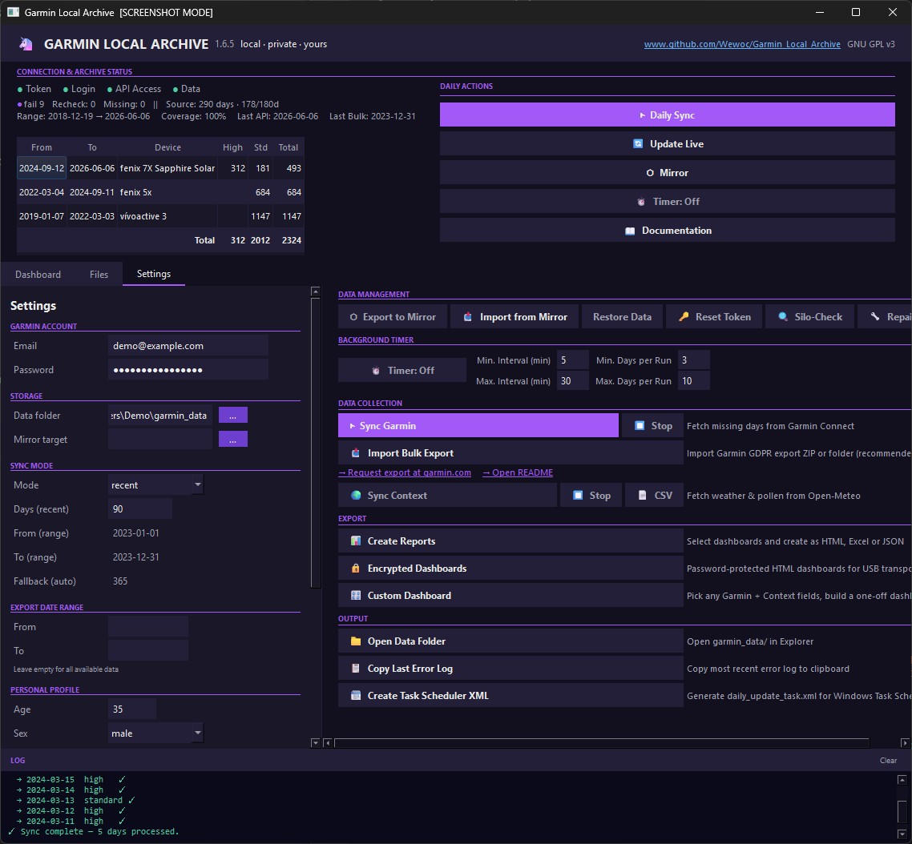
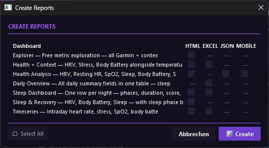
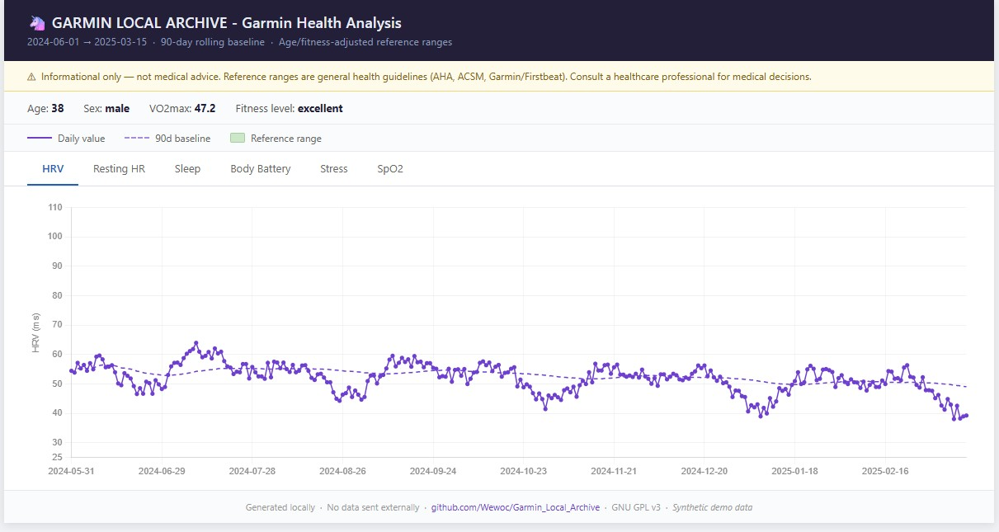
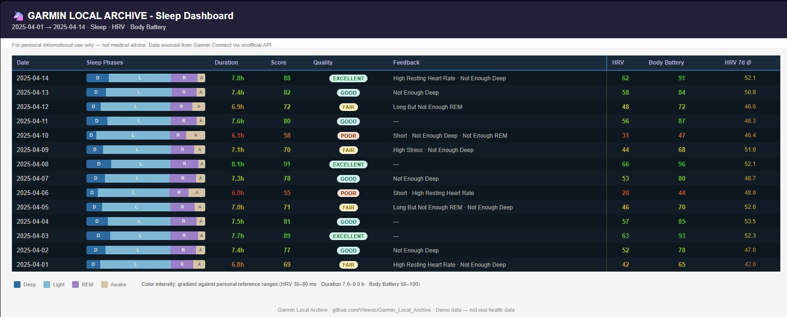
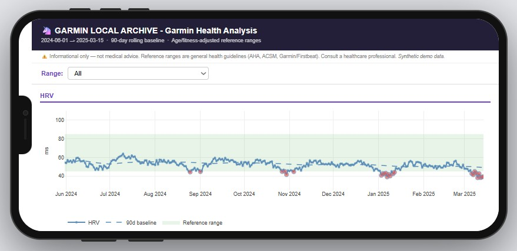
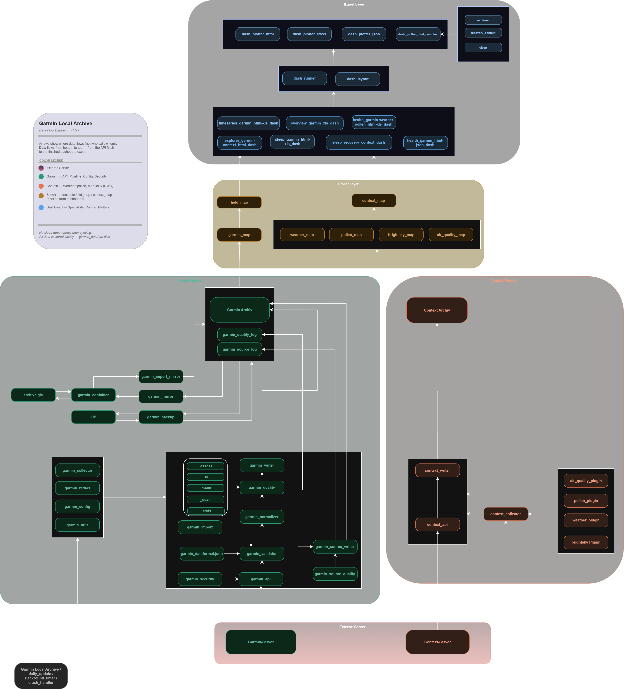

## What you'll find here

**[↓ Why this exists](#why-this-exists)** — the data loss problem that started this  
**[↓ Download](#download)** — standalone EXE, no setup needed, Windows only  
**[↓ Dashboards](#how-it-works)** — HRV, sleep, Body Battery, stress, intraday timeseries  
**[↓ Bulk Import](#recovering-your-history--bulk-import)** — recover your full Garmin history from a GDPR export  
**[↓ Local AI setup](#step-11--ai-assisted-analysis-optional)** — data ready for Ollama and Open WebUI  
**[↓ Architecture](#what-is-included)** — pipeline overview, all modules  

**Platform:** Windows · **No cloud** · **No subscription** · **No Python needed** · **Standalone EXE**

---

# Garmin Local Archive

Archive and analyze your Garmin Connect data **locally on your machine** — `create your own backup and save your data from decay` — no cloud, no third parties, no subscriptions. Everything runs locally under your control.

*Privacy first — inspired by European principles.*

---

## Why this exists

I wanted to ask an AI questions about my health data without sending that data to another cloud service. So I built a local alternative instead.

There's a second reason that matters more over time: Garmin silently degrades intraday data resolution. Empirical analysis of archive data (April 2026) shows the threshold at approximately 135 days. Once full resolution is lost, it's gone permanently. This tool exists to capture it while it's still available.

What "intraday resolution" actually means in practice:

| Metric | API resolution | Data points / day |
|---|---|---|
| Heart Rate | ~1 minute | up to 1,440 |
| Stress | ~3 minutes | up to 480 |
| Body Battery | ~15 minutes | up to 96 |
| SpO2 | ~1 hour | up to 24 |
| Respiration | variable | variable |

After ~135 days, Garmin stops serving this data entirely. The daily summary (resting HR, average stress, etc.) remains — but the curves, the detail, the full timeline: gone. GLA captures it while it's still there.

*→ For the full story, see [MINDSET.md](docs/MINDSET.md).*

---

## What makes this different

This project is as much a statement as it is a tool.

This is not a data export script — it maintains a complete, consistent
local copy of your Garmin data over time. Your data stays in open formats, readable and analyzable with any tool you choose. Local AI, cloud AI, or no AI at all. **Your data, your call.**

| Feature | Garmin Connect | Cloud-AI Bridges | **Garmin Local Archive** |
| :--- | :--- | :--- | :--- |
| **Data storage** | Garmin servers (USA) | US AI servers | **Your machine** |
| **Privacy risk** | Medium | High (training data risk) | **Minimal** |
| **Access** | Online only | Requires subscription | **100% offline** |
| **History** | Erodes over time | Depends on source | **Permanent local copy** |

---

## Download

| Version | Description | Requires |
|---|---|---|
| [Garmin_Local_Archive_Standalone.zip](https://github.com/Wewoc/Garmin_Local_Archive/releases/latest) | **Recommended — no setup needed** | Nothing |
| [Garmin_Local_Archive.zip](https://github.com/Wewoc/Garmin_Local_Archive/releases/latest) | Standard version | Python 3.10+ |

No install, no terminal. Download, unzip, run.
Standard version: install dependencies first — `pip install -r requirements.txt`.

---


<br><sub>Home tab — fixed top area with connection status, archive stats by device, and Daily Actions (Sync / Mirror / Timer); dashboard viewer below.</sub>


<br><sub>Files tab — in-app XLSX viewer with date, steps, resting HR, body battery, sleep duration and quality per day.</sub>


<br><sub>Settings tab — two-column layout: credentials, paths, and sync config on the left; sync controls, timer, mirror, and output options on the right.</sub>

**What this is not:**
Garmin Connect is still required — the app pulls data from there via API.

**A note on cloud folders:** the archive itself is stored as plaintext on disk — if `garmin_data/` lives inside a cloud-synced folder, that data gets uploaded automatically. See [SECURITY.md](SECURITY.md#container-security) for details and the encrypted Mirror alternative. This tool does not replace Connect, the Garmin app, or your device sync. It has no cloud component, no remote access, and no sharing features. The GUI and EXE are Windows-only.

---

## How it works

The app works in two modes: **live sync** pulls recent data directly from Garmin Connect via API; **Bulk Import** loads your complete history from a Garmin GDPR export ZIP — this is the primary path for recovering years of data that the API no longer serves.

Everything is stored locally in structured formats (JSON, Excel, HTML dashboards). Once downloaded, nothing is transmitted anywhere.

The built-in dashboards cover roughly 90% of what most users are looking for — without any AI at all. For deeper analysis, your data is prepared in a format any local AI can work with directly.

| Dashboard | What it shows | Output |
|---|---|---|
| **Health Analysis** | HRV, Resting HR, SpO2, Sleep, Body Battery, Stress — daily values vs 90-day personal baseline vs age/fitness-adjusted reference ranges. Flags days outside range. | HTML, Mobile HTML, JSON + AI prompt |
| **Timeseries** | Intraday heart rate, stress, SpO2, body battery and respiration as zoomable charts across any date range. | HTML, Excel |
| **Heatmap** | Six intraday metrics (Heart Rate, Steps, Stress, Body Battery, SpO2, Respiration) as time-of-day × date grids — spot daily rhythms and irregularities at a glance. | HTML |
| **Daily Overview** | All summary fields in one flat table, one row per day. | Excel |
| **Health + Context** | Garmin health metrics alongside local weather and pollen data. | HTML, Excel |
| **Sleep Dashboard** | One row per night — segmented phase bar (Deep / Light / REM / Awake), sleep duration, score, quality badge, feedback label, HRV, Body Battery, and **7-day HRV moving average** (computed from archive, no extra API call). Color-coded numbers via continuous gradient against personal reference ranges. Inspired by [Garmin's own HRV pattern guide](https://www.garmin.com/en-US/blog/fitness/understanding-the-hrv-status-on-your-garmin-smartwatch/). | HTML, Excel |
| **Sleep & Recovery** | HRV, Body Battery, Sleep duration and phase breakdown (Deep / Light / REM / Awake) alongside weather and pollen context. Intraday detail per day. | HTML |
| **Explorer** | Free metric exploration — choose up to 4 metrics from all Garmin daily fields plus weather, pollen, and air quality on a shared time axis. Sleep phase breakdown and sleep quality log included. Built-in field descriptions and air quality interpretation guide. | HTML |
| **Custom Dashboard** | Pick any combination of Garmin daily fields and Context fields, set a date range, and build a one-off dashboard — no fixed field list, no specialist file written to disk. Field selections can be saved as named presets for reuse. Optional AES-256 encryption for the HTML output. | HTML, Excel |


<br><sub>Create Reports — select dashboards and export as HTML, Excel or JSON.</sub>


<br><sub>Analysis dashboard — daily values vs 90-day personal baseline vs age/fitness-adjusted reference ranges.</sub>


<br><sub>One row per night — segmented phase bar, duration, sleep score, quality badge, Garmin feedback text, HRV, and Body Battery. Numbers are color-coded against personal reference ranges.</sub>


<br><sub>Analysis dashboard mobile version — daily values vs 90-day personal baseline vs age/fitness-adjusted reference ranges.</sub>

The AI itself is not included. How to set one up — including a ready-to-use system prompt for health data analysis — is explained in the [local AI guide](#step-11--ai-assisted-analysis-optional) below.

---

## AI-assisted development

I can't write Python. The architecture, module boundaries, and decisions are mine. Every line of code is Claude's.

*→ How this collaboration actually worked — who had which idea, where Claude was wrong — is documented in [MINDSET.md](docs/MINDSET.md).*

---

## Project status & disclaimer

> GNU General Public License v3.0 — provided as-is.

- **Not an official Garmin product:** This tool is not affiliated with, endorsed, or supported by Garmin.
- **Unofficial API:** Garmin Local Archive uses Garmin's unofficial API — it may change or break without notice.
- **Not medical advice:** All health metrics, reference ranges, and dashboard data are for personal informational use only — not a substitute for medical advice.
- **AI and health data — handle with care:** If you use an external AI service (ChatGPT, Claude, Gemini) to interpret your data: never upload documents containing your name, date of birth, or other identifying information. Cloud AI services store what you send — linked to your account. Use a local model (Ollama) or at minimum a session without login. AI responses on health topics are statistically generated — not medically validated. Treat them as a first orientation, not a conclusion.
- **Context data:** Weather data is provided by Open-Meteo and Brightsky (DWD), pollen data and air quality data by Open-Meteo — accuracy and availability are not guaranteed. Air quality data (CAMS dataset) is available from approximately 2020 onwards.
- **Early stage:** Core functionality is stable. APIs and internal structure may still change.
- **No guaranteed support:** Development happens when time and interest allow.
- **Use at your own risk:** I am not responsible for data loss or Garmin account issues.
- **Feedback welcome:** If something feels off — logic, structure, results — open an issue.

---

## Recovering your history — Bulk Import

The GDPR export from Garmin contains your complete daily history — but in our testing, no intraday data was found (no heart rate curves, no stress timelines, no body battery graphs). That resolution appears to be available only through the API, and only for recent days (see above).

The **Bulk Import** feature fills in the rest: request your full data export from Garmin (typically ready in 20–30 minutes), point the app at the ZIP, and your complete daily history lands in the local archive — in the same format as live API data. Days already present with good quality are skipped automatically.

---

## Scope & limitations

Local-first, personal use, no enterprise ambitions.

- Relies on Garmin's unofficial API — may change without notice. Structural changes are detected and logged automatically (v1.3.4)
- Six local test suites (checks + build output validation) — no CI/CD yet
- HTML dashboards require a one-time internet connection to download Plotly (~3 MB) — cached locally after that
- Large sync operations are not checkpointed yet
- Historical data quality depends on Garmin servers

This project is built for my own use. If it happens to be useful to others, feel free to use it — but evaluate it like any other unverified open-source tool.

---

## Token security & Login

Garmin login works via SSO — logging in with email and password on every
run triggers Captcha or MFA. The solution: log in once manually, and
Garmin returns an OAuth token that handles all subsequent runs for
approximately one year. This token is equivalent to a logged-in session
and must not sit unprotected on disk.

The token is encrypted at rest. Details on the encryption design and threat model: [SECURITY.md](SECURITY.md)

---

## How it works (simplified)
```
[ Garmin API ]
      │
      ▼
[ garmin_api ]         – token check → SSO login → fetch all endpoints
      │
      ▼
[ garmin_security ]    – encrypt/decrypt OAuth token (AES-256-GCM + WCM key)
      │
      ▼
[ garmin_validator ]   – structural check against garmin_dataformat.json
      │
      ▼
[ garmin_normalizer ]  – unified schema for any source + summary extraction
      │
      ▼
[ garmin_quality ]     – assess + register in quality_log.json
      │
      ▼
[ garmin_sync ]        – which days are missing?
      │
      ▼
[ garmin_collector ]   – orchestrator → decides → delegates
      │
      ▼
[ Local Archive ]
      │
      ▼
[ garmin_writer ]      – sole owner of raw/ + summary/
      │
      ▼
 [ garmin_data/ ]


[ Open-Meteo API ]
      │
      ▼
[ context_api ]        – fetches weather + pollen via plugin metadata
      │
      ▼
[ context_writer ]     – sole owner of context_data/
      │
      ▼
 [ context_data/ ]


 [ garmin_data/ ]   [ context_data/ ]
        │                  │
        ▼                  ▼
[ field_map /      [ context_map /
   garmin_map ]       weather_map /
                       pollen_map /
                       brightsky_map ]
        │                  │
        └─────────┬─────────┘
                  ▼
          [ dash_runner ]    – Auto-Discovery → popup → orchestrate
                  │
          ┌───────┼───────┐
          ▼       ▼       ▼
       [HTML]  [Excel]  [JSON + Prompt]
```
```
[ Garmin GDPR Export ZIP ]
      │
      ▼
[ garmin_import ]      – reads ZIP or folder, maps export fields to canonical schema
      │
      ▼
[ garmin_validator ]   – structural check against garmin_dataformat.json
      │
      ▼
[ garmin_normalizer ]  – pure transformation, unified schema
      │
      ▼
[ garmin_quality ]     – assess + register (source: bulk, recheck: false)
      │
      ▼
[ garmin_collector ]   – skip if API high/standard already present
      │
      ▼
[ garmin_writer ]      – sole owner of raw/ + summary/
      │
      ▼
 [ Local Archive ]     – same format as API data, fully compatible
```

> [!TIP]
> **Pipeline Architecture:** For a detailed view of the v1.3.4 data flow including the validation layer and self-healing loop, open [screenshots/flowchart_v134.html](src/screenshots/flowchart_v134.html) in your browser.

---

## System Architecture

The diagram below shows how all components relate to each other as of v1.6.x — from API ingestion and context collection through the broker layer to dashboard export.



---

## What is included

The project is structured into five focused layers. Each layer has a single responsibility — collect, validate, assess, broker, or render. No crossover between layers.

**Garmin pipeline** — `garmin/`

| Script | What it does |
|---|---|
| `garmin_collector.py` | Orchestrator — decides, delegates, coordinates the full pipeline |
| `garmin_config.py` | All configuration — ENV variables, paths, constants |
| `garmin_utils.py` | Shared utilities — date parsing, no project-module dependencies |
| `garmin_api.py` | Login and all Garmin Connect API calls |
| `garmin_security.py` | Token encryption/decryption — AES-256-GCM, key stored in Windows Credential Manager |
| `garmin_validator.py` | Structural validation against `garmin_dataformat.json` — detects API changes before they reach the normalizer |
| `garmin_normalizer.py` | Unified data schema across sources + summary extraction |
| `garmin_quality.py` | Quality assessment — sole owner of `quality_log.json`. Checksum-protected, auto-restore on mismatch |
| `garmin_sync.py` | Determines which days are missing |
| `garmin_writer.py` | Sole owner of `raw/` and `summary/` — all file writes go through here |
| `garmin_import.py` | Garmin GDPR export importer — reads ZIP or folder, feeds each day through the pipeline |
| `garmin_backup.py` | Sole owner of `garmin_data/backup/` — incremental raw backup, quality log snapshots, restore |
| `garmin_mirror.py` | Mirror operation — copies full archive to a second location (NAS, USB, OneDrive). Writes `mirror_meta.json` on success |
| `garmin_import_mirror.py` | Mirror import — selective import from a mirror folder into the local archive. Quality-rank delta, dry-run dialog, timer-safe |
| `garmin_source_quality.py` | Source quality assessment — determines whether a raw API response contains intraday data. Guards `source/` files from being overwritten by degraded responses. |
| `garmin_source_writer.py` | Sole owner of `garmin_data/source/` — stores unmodified API responses before any pipeline processing. Sole owner of `source_api_log.json`. |
| `garmin_backup_source.py` | Sole owner of `garmin_data/backup/source/` — backs up source files after each write. Provides one-time backfill for existing source files. |
| `garmin_silo_check.py` | Read-only silo drift detection — scans raw/, summary/, source/, and quality_log.json for inconsistencies. Surfaces gaps that the live pipeline does not catch: orphan files, missing summaries, unlogged raw days, source files without raw. Repair delegated to existing tools. |
| `garmin_merge.py` | Additive field merge for backfill operations — never overwrites an already-populated field. Used to retroactively add newly supported data fields (like step count) to already-archived days. |

**Context pipeline** — `context/`

| Script | What it does |
|---|---|
| `context_collector.py` | Orchestrates external API collect — date range, location, plugin loop |
| `context_api.py` | Fetches external context data based on plugin metadata — supports Open-Meteo and Brightsky adapters |
| `context_writer.py` | Sole owner of `context_data/` — all file writes go through here |
| `weather_plugin.py` | Plugin metadata — Open-Meteo Weather API fields, endpoints, file prefix |
| `pollen_plugin.py` | Plugin metadata — Open-Meteo Air Quality API fields, endpoints, aggregation |
| `brightsky_plugin.py` | Plugin metadata — Brightsky DWD Weather API fields, endpoints, field-specific aggregation |
| `airquality_plugin.py` | Plugin metadata — Open-Meteo Air Quality API fields (PM2.5, PM10, AQI, NO₂, Ozone), daily mean aggregation |

**Data brokers** — `maps/`

| Script | What it does |
|---|---|
| `field_map.py` + `garmin_map.py` | Routes dashboard requests to Garmin data — reads `garmin_data/` |
| `context_map.py` + `weather_map.py` + `pollen_map.py` + `brightsky_map.py` + `airquality_map.py` | Routes dashboard requests to context archive — reads `context_data/` |

**Dashboard layer** — `dashboards/` + `layouts/`

| Script | What it does |
|---|---|
| `dash_runner.py` | Auto-discovers specialists, builds report selection popup, orchestrates build |
| `*_dash.py` | Dashboard specialists — fetch data via brokers, return neutral dict for renderers |
| `dash_plotter_*.py` | Format renderers — HTML (Plotly), Excel, JSON + Markdown prompt |
| `dash_layout*.py` | Passive resources — color tokens, CSS variables, disclaimer, prompt templates |
| `garmin_mobile_landing.py` | Mobile landing page generator — writes `index.html` with archive status to `dashboards/` after every sync |

**Desktop app**

| Script | What it does |
|---|---|
| `garmin_app_base.py` | Assembler — fixed top (panel_home) + QTabWidget: Home / Files / Settings. PyQt6 QMainWindow. |
| `app/garmin_app_settings.py` | Settings persistence, keyring helpers, constants. No GUI — importable in any context. |
| `app/garmin_app_controller.py` | Application logic — ENV construction, archive stats, connection checks, timer calculations. No GUI. |
| `app/panel_home.py` | Fixed top area: connection indicators, archive status, device table, Daily Actions (Daily Sync / Mirror / Timer / Documentation). Home tab: Dashboard viewer. (v1.6.0+) |
| `app/panel_settings.py` | Settings panel — credentials, paths, sync config, context location. |
| `app/panel_connection.py` | Connection panel — connection test, data management (Export to Mirror / Import from Mirror / Restore / Silo-Check / Repair / Reset Token), dialogs. Indicators delegated to panel_home. |
| `app/panel_archive.py` | Archive panel — integrity check, restore, clean archive, mirror operation. |
| `app/panel_timer.py` | Timer panel — background timer UI, loop, controller delegates. |
| `app/panel_outputs.py` | Outputs panel — sync, import, context sync, dashboard build, output buttons. |
| `garmin_app.py` + `build.py` | Desktop GUI entry point + standard EXE build (Python required on target) |
| `garmin_app_standalone.py` + `build_standalone.py` | Desktop GUI entry point + standalone EXE build (no Python required) |
| `daily_update.py` / `daily_update.exe` | Headless daily sync — runs without the GUI, designed for Windows Task Scheduler automation |
| `version.py` | Single source of truth for `APP_VERSION` — no dependencies, safe for all build targets |

Each module is self-contained and designed to be extended. Add new fields, metrics, or dashboard specialists without touching the rest of the system. See `docs/MAINTENANCE_GLOBAL.md` for how.

The desktop app includes a **Background Timer** — once started, it automatically repairs failed/incomplete days, upgrades bulk-imported days within Garmin's intraday resolution window (~135 days), fills missing days, keeps a raw API-response backup current, and retroactively adds newly supported data fields (like step count) to already-archived days, with no further manual steps in between. The timer must be started manually and only runs while the app is open — it does not resume automatically after a restart.
 
Data is stored in two root folders:
 
```
garmin_data/
├── raw/        – complete API dumps (~500 KB/day) — permanent archive / basis for dashboards and analysis
├── source/     – unmodified API responses (~250 KB/day) — replay-safe intraday backup
├── summary/    – compact daily JSONs (~2 KB/day)  — basis for dashboards and analysis
└── log/        – session logs, quality register, encrypted token
 
context_data/
├── weather/raw/    – daily weather archive (Open-Meteo)
├── pollen/raw/     – daily pollen archive (Open-Meteo Air Quality)
└── brightsky/raw/  – daily weather archive (Brightsky DWD)
```


---

## Quickstart — which version should I download?

There are three ways to run Garmin Local Archive:

| | Who it's for | Requirements |
|---|---|---|
| **Standalone EXE** | Anyone — no setup needed | Nothing |
| **Standard EXE** | Users comfortable with Python | Python + libraries installed |
| **Scripts only** | Developers | Python + libraries installed |

### Option 1 — Standalone EXE (recommended for most users)

**[⬇ Download Garmin_Local_Archive_Standalone.zip](https://github.com/Wewoc/Garmin_Local_Archive/releases/latest/download/Garmin_Local_Archive_Standalone.zip)**

Extract and double-click `Garmin_Local_Archive_Standalone.exe`.

```
Garmin_Local_Archive_Standalone.exe     ← double-click to launch the GUI
daily_update.exe                        ← headless daily sync for Task Scheduler
info/                                   ← documentation + Task Scheduler XML template
```

No Python, no terminal, no dependencies. Everything is built in.
See `info/README_APP.md` for full details.

### Option 2 — Standard EXE (Python required)

**[⬇ Download Garmin_Local_Archive.zip](https://github.com/Wewoc/Garmin_Local_Archive/releases/latest/download/Garmin_Local_Archive.zip)**

Extract and double-click `Garmin_Local_Archive.exe`.

```
Garmin_Local_Archive.exe     ← double-click to launch
scripts/                     ← required, must stay next to the .exe
info/                        ← documentation (optional)
```

Python and the required libraries must be installed on your machine.
See `info/README_APP.md` for full details.

### Option 3 — Scripts only

```bash
pip install garminconnect openpyxl keyring cryptography
python garmin_collector.py
```

Python 3.10 or newer required. See the step-by-step setup below.

---

## Step-by-step setup (scripts)

### Step 1 — Install Python

1. Go to https://www.python.org/downloads/ and download the latest Python 3.x installer
2. Run the installer
3. **Important:** tick **"Add Python to PATH"** before clicking Install
4. Open a terminal (Windows: press `Win+R`, type `cmd`, press Enter) and verify:

```bash
python --version
```

You should see something like `Python 3.13.0`.

---

### Step 2 — Install required libraries

In the terminal, run:

```bash
pip install garminconnect openpyxl keyring cryptography
```

---

### Step 3 — Configure the collector

All configuration is handled via environment variables, read centrally by `garmin_config.py`. The easiest way is to use the desktop GUI (Step 9) — it sets all values automatically.

For script-only use, set the values directly in `garmin_config.py`:

```python
GARMIN_EMAIL    = os.environ.get("GARMIN_EMAIL",    "your@email.com")
GARMIN_PASSWORD = os.environ.get("GARMIN_PASSWORD", "yourpassword")
BASE_DIR        = Path(os.environ.get("GARMIN_OUTPUT_DIR") or "~/local_archive").expanduser()
```

**Sync mode** — choose how far back to go:

```python
SYNC_MODE = "recent"    # default: last 90 days
SYNC_MODE = "range"     # specific period: set SYNC_FROM and SYNC_TO below
SYNC_MODE = "auto"      # everything since your oldest device (can take hours — not recommended, rate limit risk)
```

---

### Step 4 — Run the collector

```bash
python garmin_collector.py
```

On first run the script will connect to Garmin Connect, detect your registered devices, and download all missing days. Subsequent runs only fetch what's new.

**First run may ask for browser verification** — if Garmin requires a captcha, follow the prompt in the terminal. This only happens once.

---

### Step 5 — Generate dashboards

In the desktop app: click **📊 Berichte erstellen** → select dashboards and formats → confirm.

From the scripts directly:

```bash
python dashboards/dash_runner.py
```

Available dashboards:

| Dashboard | Output | Source |
|---|---|---|
| Timeseries | HTML, Excel | Intraday HR, Stress, SpO2, Body Battery, Respiration |
| Health Analysis | HTML, JSON + Prompt | HRV, Resting HR, SpO2, Sleep, Body Battery, Stress — baseline + reference ranges |
| Daily Overview | Excel | All summary fields, one row per day + Activities sheet |
| Health + Context | HTML, Excel | Garmin health metrics combined with weather and pollen data |

Output is written to `BASE_DIR/dashboards/`. The folder opens automatically after a successful build.

> Reference ranges are based on published guidelines (AHA, ACSM, Garmin/Firstbeat) and are informational only — not medical advice.

> The Health Analysis JSON includes a ready-to-use Markdown start prompt for Open WebUI / Ollama — load `health_garmin_prompt.md` as the system prompt for AI-assisted interpretation.

---

### Step 9 — Desktop app (optional)

**Standard EXE (Python required on target machine):**

```bash
python build.py
```

Produces `Garmin_Local_Archive.exe` + `Garmin_Local_Archive.zip`.

**Standalone EXE (no Python required on target machine):**

```bash
python build_standalone.py
```

Produces `Garmin_Local_Archive_Standalone.exe` + `daily_update.exe` + `Garmin_Local_Archive_Standalone.zip` (both EXEs combined). All scripts and dependencies are embedded — the target machine needs nothing installed.

Both build scripts auto-migrate scripts to `scripts/` and docs to `info/` if they are still in the root folder. Safe to run from any starting layout.

---

### Step 10 — Automate daily sync (optional)

**Windows Task Scheduler:**

A ready-to-import XML template (`daily_update_task.xml`) ships in `info/` (Standalone + Standard) and `docs/` (Scripts only). Import it once into Windows Task Scheduler — it runs `daily_update` every morning automatically.

| Target | Entry point for Task Scheduler |
|---|---|
| Standalone | `daily_update.exe` |
| Standard EXE | `daily_update.bat` |
| Scripts only | `python daily_update.py` |

`daily_update` handles gap detection automatically: gaps up to 7 days are healed without intervention, larger gaps trigger a hard stop with a clear message to open the app.

**Linux / macOS** (daily at 07:00):

> ⚠️ **Linux / macOS note:** The collector scripts should work on any system with Python 3.10+. The GUI and EXE are Windows-only. Credential storage via `keyring` works on most desktop systems but may need an additional backend on Linux (e.g. `pip install secretstorage`). Headless environments (no desktop session) do not support keyring — store credentials via environment variables instead (`GARMIN_EMAIL`, `GARMIN_PASSWORD`).

```bash
crontab -e
# add this line:
0 7 * * * python3 /path/to/garmin_collector.py >> /path/to/local_archive/garmin_data/log/collector.log 2>&1
```

---

### Step 11 — AI-assisted analysis (optional)

Connect a local AI model to your health data. Both options run entirely on your machine — your data never leaves your PC.

> ⚠️ **Before you start:** The prompt file contains your personal health metrics. If you use a local model (Ollama), your data stays on your device. If you use a cloud service, remove any identifying details before uploading — name, date of birth, account information. AI interpretations of health data can be plausible but wrong. Always verify concerning findings with a healthcare professional.

#### Option A — Open WebUI

1. Install Ollama: https://ollama.com/download
2. Pull a model: `ollama pull qwen2.5:14b`
3. Install Open WebUI via Docker:

```bash
docker run -d -p 3000:8080 --gpus all \
  -v open-webui:/app/backend/data \
  -e OLLAMA_BASE_URL=http://host.docker.internal:11434 \
  --name open-webui --restart always \
  ghcr.io/open-webui/open-webui:cuda
```

4. Open http://localhost:3000 → Workspace → **Knowledge** → **+ New** → point to `local_archive/garmin_data/summary`
5. In chat: type `#` → select the knowledge base

#### Option B — AnythingLLM

1. Download AnythingLLM Desktop: https://anythingllm.com
2. Connect Ollama (Settings → LLM → Ollama)
3. New Workspace → Upload documents → point to `local_archive/garmin_data/summary`

#### Which one to choose?

| | Open WebUI | AnythingLLM |
|---|---|---|
| Setup effort | Medium (Docker) | Low (desktop app) |
| Chat interface | Full-featured | Clean, focused |
| Document/RAG quality | Good | Very good |
| Best for | General AI assistant + health data | Primarily health data Q&A |

**Tip:** upload `garmin_analysis.json` directly into a chat for targeted analysis — it contains pre-processed comparisons against your personal baseline and reference ranges.

Example questions:
- *"How was my sleep and HRV last week?"*
- *"Which days had Body Battery below 30?"*
- *"Compare my resting heart rate this month vs last month."*
- *"Based on the analysis file, which metrics need attention and why?"*

---

See `info/MAINTENANCE.md` for full technical documentation, how to add new fields, troubleshooting, and developer notes.

---

## Testing

Six test suites cover the full pipeline — no network, no API required:


```bash
python tests/test_local.py          # Garmin pipeline
python tests/test_local_context.py  # Context pipeline (external APIs mocked)
python tests/test_dashboard.py      # Dashboard pipeline
python tests/test_app_logic.py      # App layer (entry points, path resolution)
python tests/test_build_output.py   # Build output validation (run after build)
```

`build_all.py` runs the first three before starting either build — a failing test aborts the build. `test_build_output.py` runs automatically after both builds complete as a post-build gate. `test_app_logic.py` is run manually after changes to the entry point files.

GUI changes are verified manually before release. Full CI/CD with automated builds and release packaging is planned for a later version.

---

> ⚠️ **API Usage Notice:** This project uses an unofficial interface. Large-scale data retrieval (e.g., syncing long time ranges in a single run) may trigger rate limiting or temporary IP blocks by Garmin (HTTP 429).
>
> It is recommended to:
> - fetch data in smaller increments
> - include delays between requests
> - allow cool-down periods between sync sessions

---

*Built with Claude · [☕ buy me a coffee](https://ko-fi.com/wewoc)*