## What you'll find here

**[↓ Why this exists](#why-this-exists)** — the data loss problem that started this  
**[↓ Download](#download)** — standalone EXE, no setup needed, Windows only  
**[↓ Bulk Import](#bulk-import)** — recover your full Garmin history from a GDPR export  
**[↓ Dashboards](#dashboards)** — HRV, sleep, Body Battery, stress, intraday timeseries  
**[↓ AI chat](#ollama-chat)** — built-in Ollama chat, plus Open WebUI / AnythingLLM for advanced RAG  
**[↓ MCP Server](#mcp-server)** — local LLM tool access via Claude Desktop, Open WebUI, or any MCP client — query your archive directly, no export step  
**[↓ Architecture](#what-is-included)** — pipeline overview, all modules

**Platform:** Windows · **No cloud** · **No subscription** · **No Python needed** · **Standalone EXE**

---

# Garmin Local Archive

Archive and analyze your Garmin Connect data **locally on your machine** — `create your own backup and save your data from decay` — no cloud, no third parties, no subscriptions. Everything runs locally under your control.

*Privacy first — inspired by European principles.*

---

## A look at the app

<a href="src/screenshots/GUI-Page_1.jpg">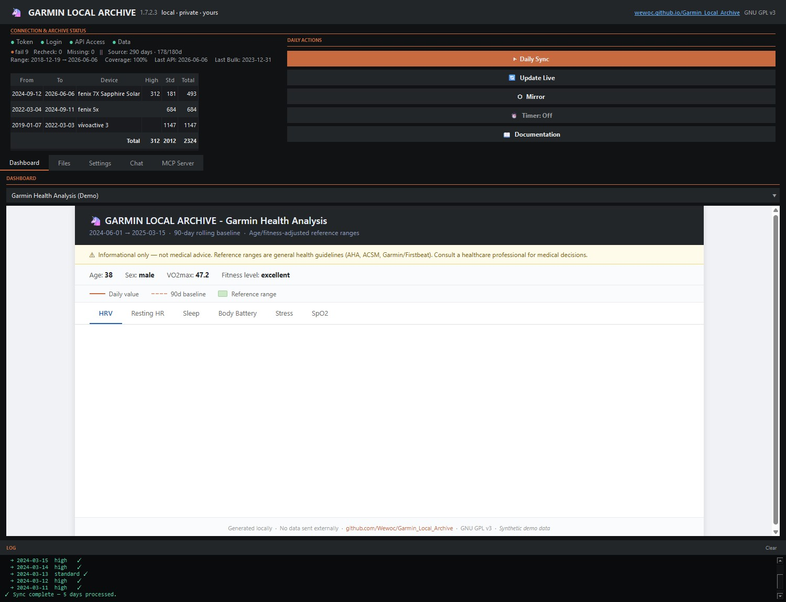</a>
<a href="src/screenshots/GUI-Page_2.jpg">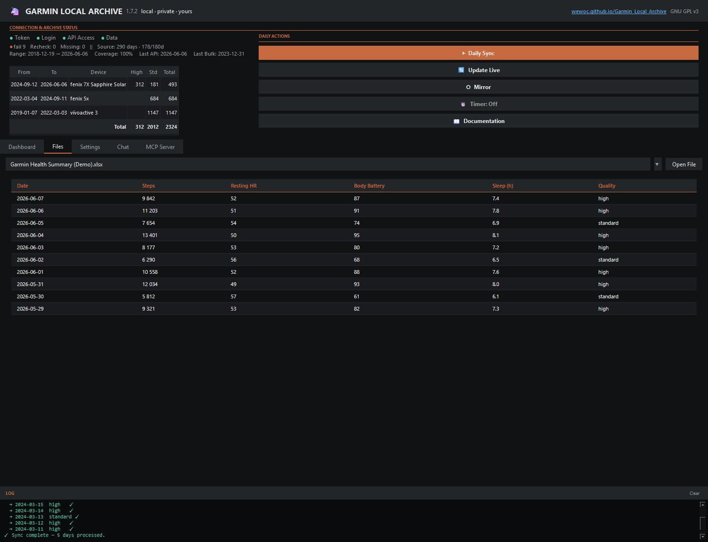</a>
<a href="src/screenshots/GUI-Page_3.jpg">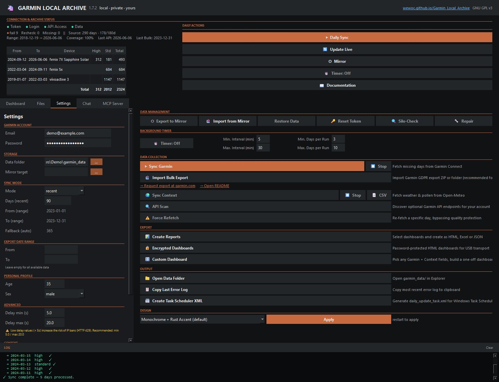</a>
<a href="src/screenshots/GUI-Page_4.jpg">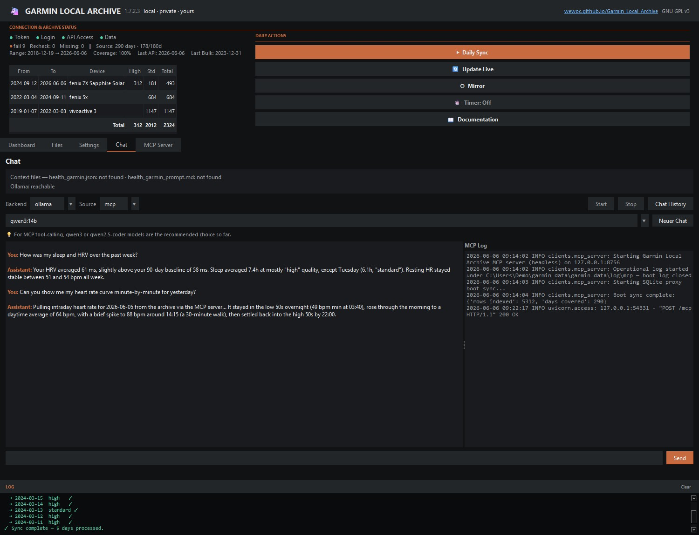</a>
<a href="src/screenshots/GUI-Page_5.jpg">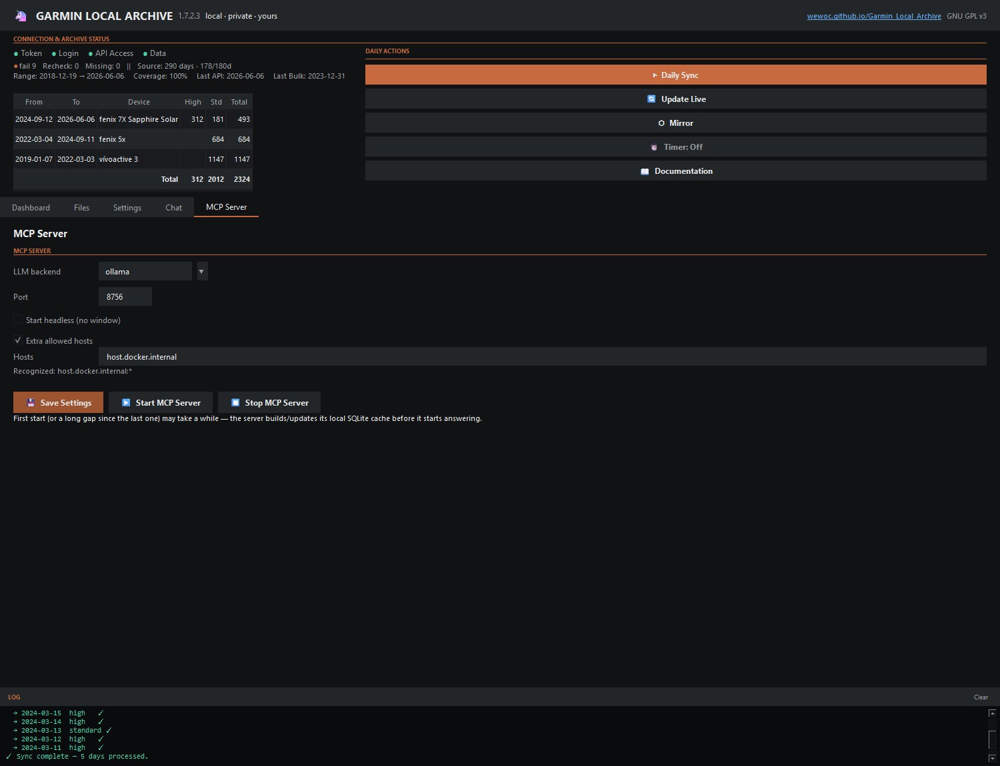</a>

<sub>Home · Files · Settings · Ollama-Chat · MCP Server — click any tab to view full size.</sub>

---

## Download

| Version | Description | Requires |
|---|---|---|
| [Garmin_Local_Archive_Standalone.zip](https://github.com/Wewoc/Garmin_Local_Archive/releases/latest) | **Recommended — no setup needed** | Nothing |
| [Garmin_Local_Archive.zip](https://github.com/Wewoc/Garmin_Local_Archive/releases/latest) | Standard version | Python 3.10+ |

No install, no terminal. Download, unzip, run.
Standard version: install dependencies first — `pip install -r requirements.txt`.

---

## Project status & disclaimer

> GNU General Public License v3.0 — provided as-is.

- **Not an official Garmin product:** This tool is not affiliated with, endorsed, or supported by Garmin.
- **Not medical advice:** All health metrics, reference ranges, and dashboard data are for personal informational use only — not a substitute for medical advice.
- **AI and health data — handle with care:** If you use an external AI service (ChatGPT, Claude, Gemini) to interpret your data: never upload documents containing your name, date of birth, or other identifying information. Cloud AI services store what you send — linked to your account. Use a local model (Ollama) or at minimum a session without login. AI responses on health topics are statistically generated — not medically validated. Treat them as a first orientation, not a conclusion.
- **Context data:** Weather data is provided by Open-Meteo and Brightsky (DWD), pollen data and air quality data by Open-Meteo — accuracy and availability are not guaranteed. Air quality data (CAMS dataset) is available from approximately 2020 onwards.
- **Early stage:** Core functionality is stable. APIs and internal structure may still change.
- **No guaranteed support:** Development happens when time and interest allow.
- **Use at your own risk:** I am not responsible for data loss or Garmin account issues.
- **Feedback welcome:** If something feels off — logic, structure, results — open an issue.

**Scope & limitations:** Local-first, personal use, no enterprise ambitions.
- Relies on Garmin's unofficial API — may change without notice. Structural changes are detected and logged automatically (v1.3.4)
- Local test suites cover the full pipeline plus a separate build-output validation suite — no automated build/test CI yet; CodeQL security scanning runs via GitHub Actions on every push/PR to main
- HTML dashboards require a one-time internet connection to download Plotly (~3 MB) — cached locally after that
- Per-day checkpointing: an interrupted sync resumes from the last completed day, no full re-sync required
- Historical data quality depends on Garmin servers

This project is built for my own use. If it happens to be useful to others, feel free to use it — but evaluate it like any other unverified open-source tool.

**What this is not:**
Garmin Connect is still required — the app pulls data from there via API.

**A note on cloud folders:** the archive itself is stored as plaintext on disk — if `garmin_data/` lives inside a cloud-synced folder, that data gets uploaded automatically. See [SECURITY.md](SECURITY.md#container-security) for details and the encrypted Mirror alternative. This tool does not replace Connect, the Garmin app, or your device sync. It has no cloud component, no remote access, and no sharing features. The GUI and EXE are Windows-only.

---

## Why this exists

I wanted to ask an AI questions about my health data without sending that data to another cloud service. So I built a local alternative instead.

There's a second reason that matters more over time: Garmin silently degrades intraday data resolution. Empirical analysis of archive data (April 2026) shows the threshold at approximately 135 days. Once full resolution is lost, it's gone permanently. This tool exists to capture it while it's still available.

What "intraday resolution" actually means in practice:

| Metric | API resolution | Data points / day |
|---|---|---|
| Heart Rate | ~1 minute | up to 1,440 |
| Stress | ~3 minutes | up to 480 |
| Body Battery | ~15 minutes | up to 96 |
| SpO2 | ~1 hour | up to 24 |
| Respiration | variable | variable |

After ~135 days, Garmin stops serving this data entirely. The daily summary (resting HR, average stress, etc.) remains — but the curves, the detail, the full timeline: gone. GLA captures it while it's still there.

*→ For the full story, see [MINDSET.md](src/docs/MINDSET.md).*

---

## What makes this different

This project is as much a statement as it is a tool.

This is not a data export script — it maintains a complete, consistent
local copy of your Garmin data over time. Your data stays in open formats, readable and analyzable with any tool you choose. Local AI, cloud AI, or no AI at all. **Your data, your call.**

| Feature | Garmin Connect | Cloud-AI Bridges | **Garmin Local Archive** |
| :--- | :--- | :--- | :--- |
| **Data storage** | Garmin servers (USA) | US AI servers | **Your machine** |
| **Privacy risk** | Medium | High (training data risk) | **Minimal** |
| **Access** | Online only | Requires subscription | **100% offline** |
| **History** | Erodes over time | Depends on source | **Permanent local copy** |

---

## AI-assisted development

I can't write Python. The architecture, module boundaries, and decisions are mine. Every line of code is Claude's.

*→ How this collaboration actually worked — who had which idea, where Claude was wrong — is documented in [MINDSET.md](src/docs/MINDSET.md).*

---

## How it works

The app works in two modes: **live sync** pulls recent data directly from Garmin Connect via API; **Bulk Import** loads your complete history from a Garmin GDPR export ZIP — this is the primary path for recovering years of data that the API no longer serves.

Everything is stored locally in structured formats (JSON, Excel, HTML dashboards). Once downloaded, nothing is transmitted anywhere.

---

### Bulk Import

The GDPR export from Garmin contains your complete daily history — but in our testing, no intraday data was found (no heart rate curves, no stress timelines, no body battery graphs). That resolution appears to be available only through the API, and only for recent days.

The **Bulk Import** feature fills in the rest: request your full data export from Garmin (typically ready in 20–30 minutes), point the app at the ZIP, and your complete daily history lands in the local archive — in the same format as live API data. Days already present with good quality are skipped automatically.

---

### Dashboards

The built-in dashboards cover roughly 90% of what most users are looking for — without any AI at all. For deeper analysis, your data is prepared in a format any local AI can work with directly.

| Dashboard | What it shows | Output |
|---|---|---|
| **Health Analysis** | HRV, Resting HR, SpO2, Sleep, Body Battery, Stress — daily values vs 90-day personal baseline vs age/fitness-adjusted reference ranges. Flags days outside range. | HTML, Mobile HTML, JSON + AI prompt |
| **Timeseries** | Intraday heart rate, stress, SpO2, body battery and respiration as zoomable charts across any date range. | HTML, Excel |
| **Heatmap** | Six intraday metrics (Heart Rate, Steps, Stress, Body Battery, SpO2, Respiration) as time-of-day × date grids — spot daily rhythms and irregularities at a glance. | HTML |
| **Daily Overview** | All summary fields in one flat table, one row per day. | Excel |
| **Health + Context** | Garmin health metrics alongside local weather and pollen data. | HTML, Excel |
| **Sleep Dashboard** | One row per night — segmented phase bar (Deep / Light / REM / Awake), sleep duration, score, quality badge, feedback label, HRV, Body Battery, and **7-day HRV moving average** (computed from archive, no extra API call). Color-coded numbers via continuous gradient against personal reference ranges. Inspired by [Garmin's own HRV pattern guide](https://www.garmin.com/en-US/blog/fitness/understanding-the-hrv-status-on-your-garmin-smartwatch/). | HTML, Excel |
| **Sleep & Recovery** | HRV, Body Battery, Sleep duration and phase breakdown (Deep / Light / REM / Awake) alongside weather and pollen context. Intraday detail per day. | HTML |
| **Explorer** | Free metric exploration — choose up to 4 metrics from all Garmin daily fields plus weather, pollen, and air quality on a shared time axis. Sleep phase breakdown and sleep quality log included. Built-in field descriptions and air quality interpretation guide. | HTML |
| **Custom Dashboard** | Pick any combination of Garmin daily fields and Context fields, set a date range, and build a one-off dashboard — no fixed field list, no specialist file written to disk. Field selections can be saved as named presets for reuse. Optional AES-256 encryption for the HTML output. | HTML, Excel |

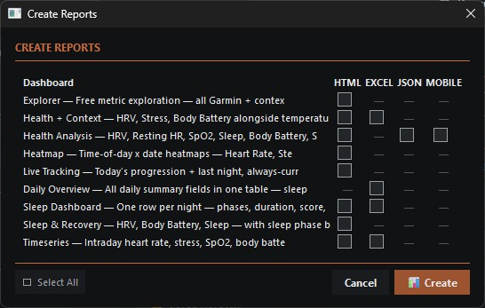
<br><sub>Create Reports — select dashboards and export as HTML, Excel or JSON.</sub>

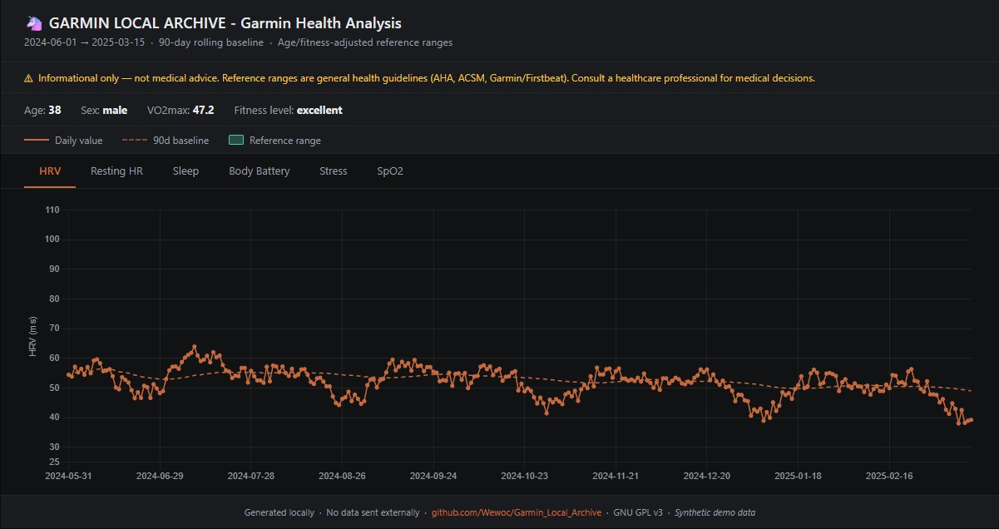
<br><sub>Analysis dashboard — daily values vs 90-day personal baseline vs age/fitness-adjusted reference ranges.</sub>

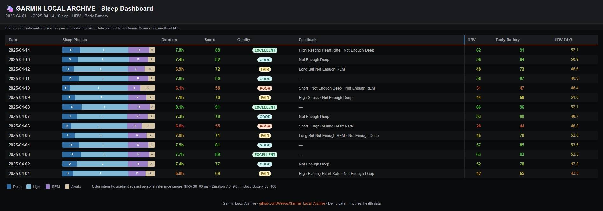
<br><sub>One row per night — segmented phase bar, duration, sleep score, quality badge, Garmin feedback text, HRV, and Body Battery. Numbers are color-coded against personal reference ranges.</sub>

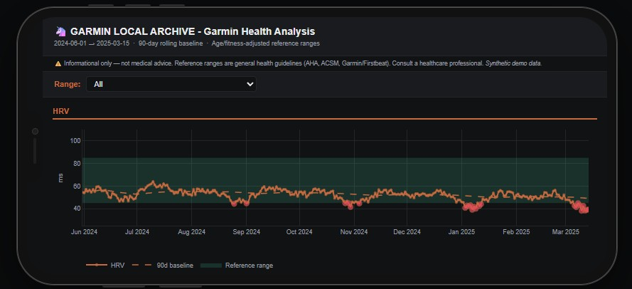
<br><sub>Analysis dashboard mobile version — daily values vs 90-day personal baseline vs age/fitness-adjusted reference ranges.</sub>

**Live Tracking** (v1.6.5) — a separate, always-current view: today's progression (Body Battery, Heart Rate, Steps, Stress) plus last night's sleep summary, refreshed automatically after every sync and on demand via an "Update Live" button in the Home tab. Not part of the Create Reports selection above — it has its own trigger, by design.

---

### Ollama-Chat

A native Ollama chat panel is built into the app (**Ollama-Chat** tab, v1.6.6) — no separate setup beyond having Ollama itself installed and a model pulled. It currently works against summary data only; full intraday resolution is planned for v1.9. For connecting external tools (Open WebUI, AnythingLLM) for more advanced document/RAG workflows, see `info/README_APP.md`.

---

### MCP Server

Garmin Local Archive exposes your archive to local LLMs via the [Model
Context Protocol](https://modelcontextprotocol.io/) — ask an LLM about your
health and context data directly, without exporting files or copy-pasting
into a chat window. Runs as its own standalone process, independent of the
main app.

Two ways to run it: a **▶️ Start MCP Server** button on the app's own
**MCP Server** tab (uses the same archive path and settings as the rest of
the app), or the standalone `mcp_server.exe` — a self-contained tool with
its own small window, usable even without the main app installed.

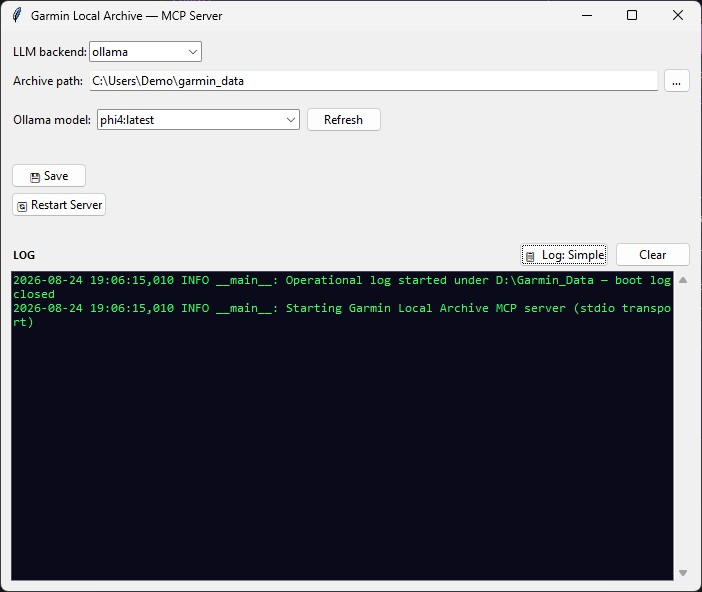
<br><sub>Standalone MCP server window (<code>mcp_server.exe</code>) — runs independently of the main app, with its own archive path, backend selection, and live log.</sub>

Running Open WebUI (or any other MCP client) inside Docker? An opt-in
"Extra allowed hosts" field on the MCP Server tab (v1.7.0.2) lets you add
`host.docker.internal` — pre-filled by default — to the server's allowed-
host list, since the underlying MCP SDK otherwise rejects connections
that don't arrive as `127.0.0.1`/`localhost`.

Works with Ollama (fully local, default) or an optional cloud LLM backend —
your choice, no default push toward either. Point your MCP-compatible
client (Claude Desktop, Open WebUI, or similar) at the server and start
asking questions.

---

## Architecture

### Token security & Login

Garmin login works via SSO — logging in with email and password on every
run triggers Captcha or MFA. The solution: log in once manually, and
Garmin returns an OAuth token that handles all subsequent runs for
approximately one year. This token is equivalent to a logged-in session
and must not sit unprotected on disk.

The token is encrypted at rest. Details on the encryption design and threat model: [SECURITY.md](SECURITY.md)

---

### Pipeline

Live sync and Bulk Import both flow through the same validation and quality pipeline before anything lands in the local archive — the diagram below shows the full picture.

> [!TIP]
> **Pipeline Architecture:** For a detailed view of the v1.3.4 data flow including the validation layer and self-healing loop, open [screenshots/flowchart_v134.html](src/screenshots/flowchart_v134.html) in your browser.

---

### System Architecture

The diagram below shows how all components relate to each other as of v1.6.x — from API ingestion and context collection through the broker layer to dashboard export. The broker layer also includes `gateway_map` (v1.6.7), a cross-domain routing layer used by the local MCP server (v1.7, see above) among other consumers — existing dashboards are unaffected and continue to query `health_map`/`context_map` directly.

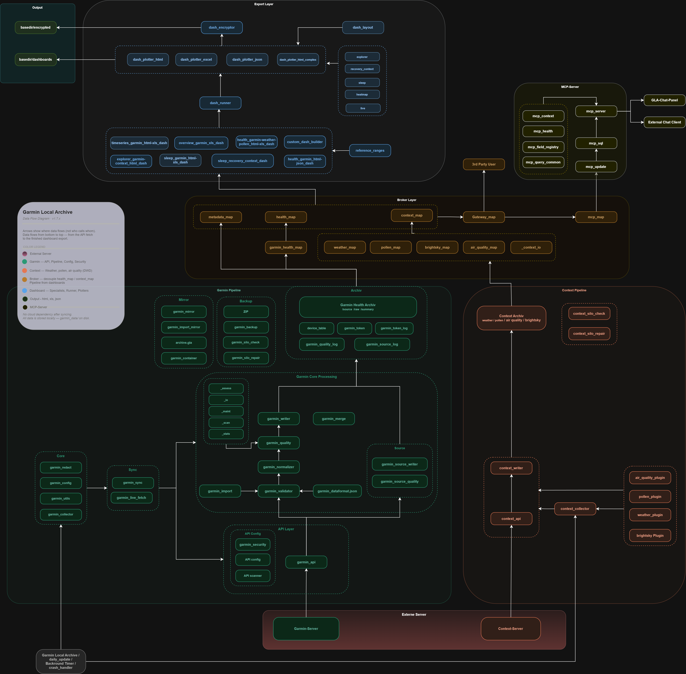

---

### What is included

The project is structured into five focused layers — Garmin pipeline, Context pipeline, Data brokers, Dashboard layer, Desktop app. Each layer has a single responsibility — collect, validate, assess, broker, or render. No crossover between layers.

The diagram above shows how the layers connect. Each module is self-contained and designed to be extended — for a script-by-script reference (what each module does, owns, and how to add new ones), see [`docs/MAINTENANCE_GLOBAL.md`](src/docs/MAINTENANCE_GLOBAL.md).

The desktop app includes a **Background Timer** — once started, it automatically repairs failed/incomplete days, upgrades bulk-imported days within Garmin's intraday resolution window (~135 days), fills missing days, keeps a raw API-response backup current, and retroactively adds newly supported data fields (like step count) to already-archived days, with no further manual steps in between. The timer must be started manually and only runs while the app is open — it does not resume automatically after a restart.

Data is stored in two root folders:

```
garmin_data/
├── raw/        – complete API dumps (~500 KB/day) — permanent archive / basis for dashboards and analysis
├── source/     – unmodified API responses (~250 KB/day) — replay-safe intraday backup
├── summary/    – compact daily JSONs (~2 KB/day)  — basis for dashboards and analysis
└── log/        – session logs, quality register, encrypted token

context_data/
├── weather/raw/    – daily weather archive (Open-Meteo)
├── pollen/raw/     – daily pollen archive (Open-Meteo Air Quality)
└── brightsky/raw/  – daily weather archive (Brightsky DWD)
```

---

See `info/MAINTENANCE.md` for full technical documentation, how to add new fields, troubleshooting, and developer notes.

---

## Testing

Eight test suites cover the full pipeline — no network, no API required:

```bash
python tests/test_local.py          # Garmin pipeline
python tests/test_local_context.py  # Context pipeline (external APIs mocked)
python tests/test_dashboard.py      # Dashboard pipeline
python tests/test_broker.py         # Broker layer (health_map / gateway_map routing, metadata_map)
python tests/test_mcp.py            # MCP layer (mcp_map protocol translation)
python tests/test_app_logic.py      # App layer (entry points, path resolution)
pytest tests/test_qt_app.py         # PyQt6 App layer
python tests/test_static.py         # ruff + bandit + regression guards
python tests/test_build_output.py   # Build output validation (run after build)
```

`build_all.py` runs `test_local.py`, `test_local_context.py`, `test_dashboard.py`, `test_broker.py`, and `test_static.py` as pre-build gates — a failing test aborts the build before either target is built. `test_build_output.py` and `test_app_logic.py` run automatically after both builds complete, as post-build gates. `test_qt_app.py` is run manually via `pytest`.

GUI changes are verified manually before release. Full CI/CD with automated builds and release packaging is planned for a later version.

---

> ⚠️ **API Usage Notice:** This project uses an unofficial interface. Large-scale data retrieval (e.g., syncing long time ranges in a single run) may trigger rate limiting or temporary IP blocks by Garmin (HTTP 429).
>
> It is recommended to:
> - fetch data in smaller increments
> - include delays between requests
> - allow cool-down periods between sync sessions

---

*Built with Claude · [☕ buy me a coffee](https://ko-fi.com/wewoc)*