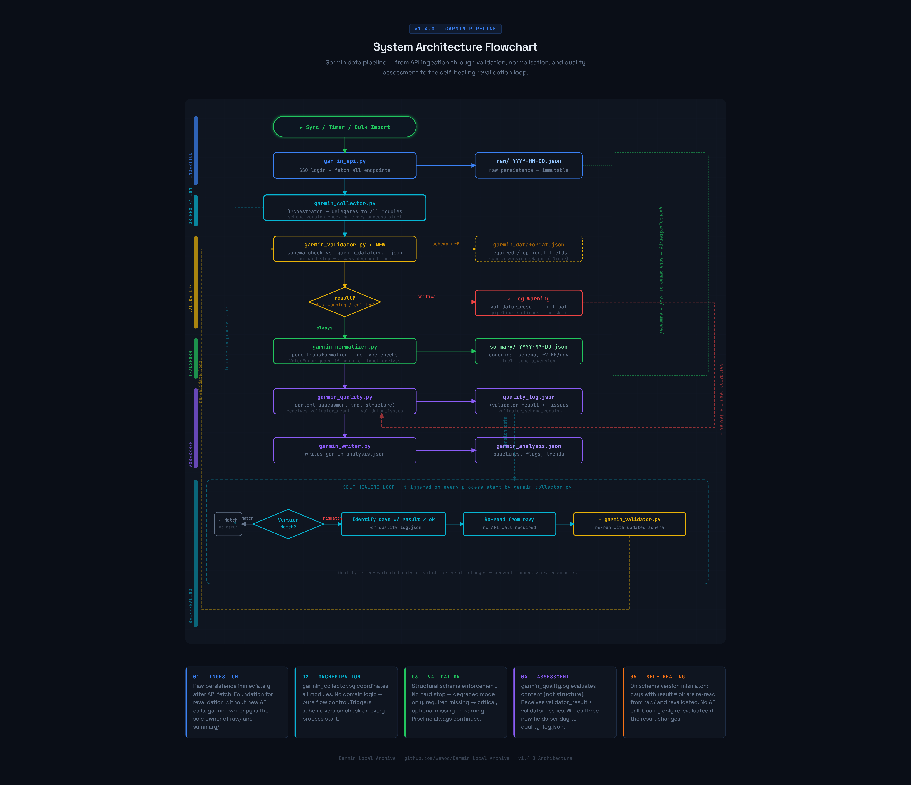

# Garmin Local Archive — Global Maintenance Guide

Build process, test suite overview, release workflow, and session collaboration process.
For pipeline-specific maintenance see `MAINTENANCE_GARMIN.md` and `MAINTENANCE_CONTEXT.md`.

---

## System Architecture



> [!TIP]
> **Interactive version:** Open [../screenshots/flowchart_garmin_v140.html](../screenshots/flowchart_garmin_v140.html) in your browser for the full diagram with readable labels.

---

## Dashboard Pipeline


> [!TIP]
> **Interactive version:** Open [../screenshots/flowchart_dashboard_v140.html](../screenshots/flowchart_dashboard_v140.html) in your browser for the full diagram with readable labels.

---

## Three build targets

| Target | GUI entry point | Daily Sync entry point | Build script | Python on target |
|---|---|---|---|---|
| 1 — Dev | `garmin_app.py` | `python scheduler/daily_update.py` | — | Required |
| 2 — Standard EXE | `garmin_app.py` | `scheduler/daily_update.bat` | `compiler/build.py` | Required |
| 3.1 — Standalone GUI | `garmin_app_standalone.py` | — | `compiler/build_standalone.py` | Not required |
| 3.2 — Standalone headless | — | `daily_update.exe` | `compiler/build_standalone.py` | Not required |

`build_all.py` runs both targets sequentially, preceded by the full test suite.

**Crash visibility (v1.6.0.4.3):** `crash_handler.py` is installed at the top
of `__main__` in both GUI entry points (`garmin_app.py`, `garmin_app_standalone.py`),
before `QApplication`. It is registered in `SHARED_SCRIPTS` /
`SCRIPT_SIGNATURES_BASE` in `build_manifest.py` — both Target 2 and Target 3
bundle it automatically. `daily_update.py` (headless, all targets) does not
install it yet — `crash_handler.install()` is entry-point-agnostic and can be
adopted there in a future step; not bundled with this delivery (separate scope).

**Headless scope (v1.6.5.3):** `daily_update.py` performs the daily sync only —
it has no equivalent to the GUI Timer's maintenance modes (`repair`, `quality`,
`fill`, `source_backfill`, `steps_backfill`, `bulk_recheck`, `check_integrity`).
This is a deliberate scope boundary, not an oversight: these modes are
interventions on the archive that benefit from someone watching and able to
abort — the same reasoning behind excluding `_run_live_fetch()` from headless
(`panel_outputs.py`, v1.6.5). Maintenance stays GUI-only; automate the daily
sync, run maintenance manually when needed.

**QWebEngine hardening (v1.6.0.4.4, A5):** `qwebengine_hardening.py` is called
once after each `QWebEngineView()` instantiation — `panel_home.py` (dashboard
viewer) and `garmin_app_base.py` (XLSX preview). It disables
`LocalContentCanAccessFileUrls`, `LocalContentCanAccessRemoteUrls`,
`JavascriptCanOpenWindows`, `PluginsEnabled`, `JavascriptCanAccessClipboard`.
`JavascriptEnabled` stays enabled — Plotly requires it. Registered in
`SHARED_SCRIPTS` / `SCRIPT_SIGNATURES_BASE` in `build_manifest.py` — both
Target 2 and Target 3 bundle it automatically. A second, previously
undocumented `QWebEngineView` instance (`garmin_app_base.py`, XLSX preview)
was discovered during the A5 dependency scan — both call sites are now
covered.

---

## Building a release

**Target 2:**
```bash
python compiler/build.py
```
Produces `Garmin_Local_Archive.exe` and `Garmin_Local_Archive.zip`.

**Target 3 (T3.1 GUI + T3.2 Headless):**
```bash
python compiler/build_standalone.py
```
Produces `Garmin_Local_Archive_Standalone.exe`, `daily_update.exe`, and `Garmin_Local_Archive_Standalone.zip` (both EXEs combined).

**Both targets (with pre-build tests):**
```bash
python compiler/build_all.py
```

Upload `Garmin_Local_Archive.zip` and `Garmin_Local_Archive_Standalone.zip` to the GitHub release page.

**T2 ZIP layout (`Garmin_Local_Archive.zip`):**
Garmin_Local_Archive.exe
Starte_Daily_Sync.bat       ← user entry point for daily sync
scheduler/
daily_update.py
daily_update.bat
scripts/
garmin_app.py
garmin/ maps/ context/ dashboards/ layouts/
info/
README.md
daily_update_task.xml
`scheduler/` stays at ZIP root — `daily_update.py` uses `.parent.parent` to locate `scripts/`.
`Starte_Daily_Sync.bat` `cd`s into `scheduler/` before calling `daily_update.py`.
When adding new scheduler files: add to `validate_scripts()` in `build.py` **and** to Section 2 + Section 6 in `test_build_output.py`.

---

## Pre-build validation

Both build scripts run `validate_scripts()` before PyInstaller starts:

1. Every required script is present in its folder
2. Key scripts contain expected function/class signatures

| Script | Required signatures |
|---|---|
| `garmin_app.py` | `class GarminApp` |
| `garmin_app_standalone.py` | `class GarminApp` |
| `garmin_api.py` | `def login`, `def fetch_raw` |
| `garmin_collector.py` | `def main`, `def _fetch_and_assess`, `def run_import` |
| `garmin_import.py` | `def load_bulk`, `def parse_day` |
| `garmin_quality.py` | `def _upsert_quality` |
| `garmin_config.py` | `GARMIN_EMAIL` |
| `garmin_security.py` | `def load_token`, `def save_token` |
| `garmin_normalizer.py` | `def normalize`, `def summarize` |
| `garmin_validator.py` | `def validate`, `def reload_schema`, `def current_version` |
| `garmin_writer.py` | `def write_day`, `def read_raw` |
| `garmin_sync.py` | `def get_local_dates`, `def resolve_date_range` |
| `app/garmin_app_settings.py` | `def load_settings`, `def save_settings`, `def load_password`, `def save_password` |
| `app/garmin_app_controller.py` | `def build_env_dict`, `def check_connection`, `def timer_run_repair`, `def timer_run_fill` |

Signature list is defined in `build_manifest.py` as `SCRIPT_SIGNATURES_BASE`.

---

## Adding a new module

Add the filename with subfolder prefix to `SHARED_SCRIPTS` in `build_manifest.py`:
```python
"garmin/garmin_newmodule.py"
"context/new_plugin.py"
"maps/new_map.py"
```
Both builds pick it up automatically. No changes to `build.py` or `build_standalone.py`.

---

## Adding a hidden import

Dynamically loaded modules (via `importlib`) are not detected by PyInstaller automatically. If either build fails with `ImportError` at runtime, add the missing module as a hidden import.

**Target 2 (`build.py`):** add `"--hidden-import", "module_name"` to the `cmd` list in `build_exe()`.

**Target 3 (`build_standalone.py`):** add the missing module to the `hidden` list in `build_exe()`.

Known hidden imports:
- `openpyxl` — required by `dash_plotter_excel.py` (dynamically loaded by `dash_runner.py`)
- `openpyxl.cell._writer` — required by openpyxl internally
- `garminconnect` — T2 only; not auto-detected by PyInstaller (v1.5.4.3)
- `curl_cffi` — transitive dependency of garminconnect 0.3.0+; T2 only (v1.5.4.3)
- `curl_cffi.requests` — transitive dependency of garminconnect 0.3.0+; T2 only (v1.5.4.3)
- `ua_generator` — transitive dependency of garminconnect 0.3.0+; T2 only (v1.5.4.3)
- `keyring` — WCM backend not auto-detected by PyInstaller; T2 only (v1.5.4.4)
- `keyring.backends` — required for backend discovery; T2 only (v1.5.4.4)
- `keyring.backends.Windows` — Windows Credential Manager backend; T2 only (v1.5.4.4)
- `PyQt6.QtNetwork` — required by `QLocalServer`/`QLocalSocket` (single-instance guard); T2 + T3 (v1.6.0.7)

Note: T3 already had keyring hidden imports since initial standalone build.
T2 was missing them — password field appeared empty on every start. T2 was missing them — garminconnect showed as "not installed" at runtime despite being installed on the system.

**How to diagnose a missing hidden import:**
In `_load_plotters()` the `except: pass` silently swallows load errors. To surface them temporarily:
```python
except Exception as _e:
    plotters[fmt] = None
    plotters[f"{fmt}_err"] = str(_e)
```
Then log `plotters` via `self._log()` in `garmin_app.py` after `dash_runner._load_plotters()`. The `_err` key shows the exact missing module.

---

## Diagnosing frozen build issues (T2 / T3)

### T2 vs T3 — structural difference

| | T2 (Python required) | T3 (Standalone) |
|---|---|---|
| Scripts location | `scripts/` next to EXE | `sys._MEIPASS/scripts/` (temp, embedded) |
| `sys.frozen` | `True` | `True` |
| `sys._MEIPASS` | exists (temp, EXE only) | exists (temp, all scripts) |
| Distinguish via | `(_MEIPASS / "scripts" / "dashboards" / "dash_runner.py").exists()` → False | same check → True |

Centralized since v1.6.5.4 in `frozen_paths.scripts_root()` — the six
previously independent copies in `panel_outputs.py` and the three `info/`
lookups in `panel_outputs.py`/`panel_home.py` (`frozen_paths.doc_path()`)
now share this one implementation. `garmin_app.py`/`garmin_app_standalone.py`'s
own `script_dir()`/`script_path()` are a separate, unrelated concept (point
at `garmin/` in dev mode, not the project root) and were not folded in —
see `frozen_paths.py` section below for the boundary.

### Logging in frozen builds

`logging.warning()` is never visible in the GUI log. For frozen-build diagnostics always use:

- `raise RuntimeError("DIAG: ...")` — surfaces in the `except` block that calls `self._log()`
- `self._log(f"[DIAG] ...")` — direct, requires access to `self`

Never use `logging.warning()` for build-path diagnostics — it disappears silently.

### Secret redaction in logs

`garmin_redact.py` (Leaf-Node) replaces the live `GARMIN_EMAIL`/`GARMIN_PASSWORD`
value with `[GARMIN_EMAIL]`/`[GARMIN_PASSWORD]` placeholders — exact-value
match only, no pattern matching on unknown exception text. Applied at two
points: `garmin_collector.py._start_session_log()` registers `RedactFilter()`
on the session `FileHandler` (covers every `log.*()` call from any module,
including session log files later copied to `log/fail/`); `garmin_app_base.py._log()`
calls `redact()` directly before writing to the GUI log widget (this path
does not go through the `logging` module). `panel_outputs.py._copy_last_error_log()`
needs no separate redaction — the fail-log file it reads is already
redacted at write time.

### `__file__` in frozen builds

`Path(__file__).parent` inside a dynamically loaded module (via `importlib.spec_from_file_location`) reflects the path passed to `spec_from_file_location` — not `_MEIPASS`. Verify with `raise RuntimeError(f"DIAG: {__file__!r}")` if path resolution is unclear.

### `frozen_paths.py` — centralized path resolution (v1.6.5.4)

Leaf-Node in `src/`, alongside `crash_handler.py` / `qwebengine_hardening.py`.
Three deliberately separate functions — no single function with a hidden
side effect:

- `scripts_root() -> Path` — seiteneffektfrei. Dev: `Path(__file__).parent`
  (i.e. `src/`, since the module itself lives at `src/frozen_paths.py`).
  Frozen: canonical T2/T3 distinguisher (see table above).
- `add_to_path(root, *subs) -> None` — explicit `sys.path` mutation.
  Without `subs`, inserts `root` itself. Kept separate from `scripts_root()`
  because one call site (`_run_custom_dashboard_encrypted` in
  `panel_outputs.py`) needs the root without touching `sys.path` at all —
  folding the mutation into the root getter would have needed an opt-out
  flag there.
- `doc_path(filename) -> Path | None` — mirrors
  `compiler/build.py::prepare_scripts_dir()`'s search order for shipped
  docs (`README_APP.md`, `QUICKSTART.txt`, `USER_GUIDE.txt`,
  `daily_update_task.xml`): frozen → `info/` next to the EXE; dev → repo
  root → `src/docs/` → `src/scheduler/`. Returns `None` if nothing is
  found — callers must handle that, no silent fallback path is invented.

**Scope boundary — what is *not* covered by this module:**

- `garmin_app.py` / `garmin_app_standalone.py`'s own `script_dir()` /
  `script_path()` — different root concept, see
  "script_path() resolution (EXE targets)" above. Deliberately untouched.
- `dashboards/dash_runner.py::_load_plotters()` and
  `layouts/dash_plotter_html_complex.py` — both resolve paths
  `__file__`-relative *within their own package*, a structurally different
  and already-safe case (crossing a package boundary is what makes the
  centralized cases risky, not `__file__`-relative resolution itself).
- `scheduler/daily_update.py::_setup_paths()` — its own, independent,
  already-consistent implementation. Reviewed as a sibling during v1.6.5.4,
  left as-is.

---

## Test suite

### `tests/test_local.py` — Garmin pipeline


```bash
python tests/test_local.py
```

**Current count: 498 checks, 22 sections.** No network, no GUI, no API calls. Cleans up after itself.

Run after any change to: `garmin_config`, `garmin_sync`, `garmin_normalizer`, `garmin_quality`, `garmin_writer`, `garmin_collector`, `garmin_security`, `garmin_utils`, `garmin_validator`.

### `tests/test_local_context.py` — context pipeline

```bash
python tests/test_local_context.py
```

**Current count: 261 checks, 13 sections.** No network — Open-Meteo API is mocked. Cleans up after itself.

Run after any change to: `context_collector`, `context_api`, `context_writer`, `weather_plugin`, `pollen_plugin`, `weather_map`, `pollen_map`, `context_map`.

### `tests/test_dashboard.py` — Dashboard pipeline


```bash
python tests/test_dashboard.py
```

**Current count: 445 checks, 18 sections.** No network, no GUI. Covers full pipeline: `garmin_map` intraday normalization → brokers → layout resources → all specialists → all plotters → runner.

Run after any change to: `garmin_map`, `field_map`, `context_map`, `dash_layout`, `dash_layout_html`, `reference_ranges`, any `*_dash.py` specialist, any `dash_plotter_*`.

### Plotly local cache

`layouts/plotly.min.js` is read by `dash_layout_html.get_plotly_script()` — pure read, no network access (v1.6.0.4.4+). The file must exist before any dashboard render:

- T1 (dev): `build_all.py.ensure_plotly_bundle()` is the only place in the project that ever downloads Plotly. If you build T1 without ever running `build_all.py`, the file may be missing — rendering then raises `FileNotFoundError` with a clear message, no silent fallback to an unverified CDN tag.
- T2/T3: bundled at build time via `REQUIRED_DATA_FILES` in `build_manifest.py` — both build scripts iterate this list generically (no longer hardcoded to `garmin/`).

**Version pinning:** `PLOTLY_VERSION` and `PLOTLY_SHA256` in `dash_layout_html.py` are pinned together — the version is never auto-updated to "latest". `ensure_plotly_bundle()` re-downloads only on hash mismatch or missing file, then verifies the download against `PLOTLY_SHA256` before writing it — a CDN response that doesn't match the pinned hash aborts the build rather than silently proceeding.

To upgrade Plotly deliberately: update `PLOTLY_VERSION` and `PLOTLY_CDN` in `dash_layout_html.py`, compute the new file's SHA-256 manually (e.g. via PowerShell `Get-FileHash`), update `PLOTLY_SHA256`, delete the local `layouts/plotly.min.js`, then run `build_all.py`.

Upstream Plotly.js releases are monitored passively via `tests/check_deps.py` (`plotly/plotly.js` entry in `GITHUB_REPOS`) — surfaces new releases on `run_T1.bat` start, decision to upgrade stays manual.

### CVE Whitelist Check

`tests/check_cve_whitelist.py` runs `pip-audit -r requirements.txt`, then matches
any reported finding against a whitelist of known-safe usage patterns in
`cve_whitelist.py` (per-package: which functions/modules from the vulnerable
package are actually used). Pure report, no automatic build-abort criterion —
`pip-audit` and OSV severity fields are not reliable enough for an automated
gate (decision, see `NOTES_v1_6_0_4_4.md`).

Three verdicts per finding: `relevant` (direct function-name match — the
vulnerable code path is in use), `not_relevant` (package whitelisted, no
matching usage), `unsure` (package not whitelisted, or ambiguous). `unsure`
findings are additionally checked against a local Ollama model
(`OLLAMA_MODEL`, default `phi4:14b`) — a short text comparison between the
CVE description and the package's actual usage in the project. Upgrades to
`relevant` are marked `(via Ollama)` in the report for traceability.

Integrated into `build_all.py` as the final post-build step — return code is
logged but never aborts the build. Also runnable standalone via
`run_cve_check.bat` (plain `.bat`, no PowerShell — chosen after a real
PowerShell encoding/syntax failure during integration attempts, see
`NOTES_v1_6_0_4_4.md`).

### `tests/test_app_logic.py` — App layer


```bash
python tests/test_app_logic.py
```

**Current count: 145 checks, 19 sections.**

### `tests/test_qt_app.py` — PyQt6 App layer (v1.5.4+)

```bash
pytest tests/test_qt_app.py -v
# or via: tests/run_qt_tests.bat
```

**Current count: 46 checks, 8 classes.** Requires `pytest`, `pytest-qt`, `PyQt6` (all in `requirements.txt`). Tests Qt-specific behaviour — panel instantiation, Signal/Slot contracts, widget state, cross-thread dispatch patterns. Does NOT duplicate `test_app_logic.py` — that suite covers Settings/Controller logic which remains tkinter-free.

**Test result v1.6.0:** 316 / 261 / 303 / 128 / 42 / 2 — all green

**Test result v1.6.0.2:** 339 / 261 / 303 / 128 / 42 / 2 — all green

**Test result v1.6.0.3:** 344 / 261 / 303 / 136 / 42 / 2 — all green

Classes:
- `TestQtSmoke` (4) — QApplication startup, PyQt6 importability, GUI-freedom regression for Settings/Controller, GUI-freedom guard for `scheduler/daily_update.py`
- `TestPanelSettings` (5) — instantiation, `_collect_settings()` keys, sync mode switching, location extraction
- `TestPanelConnection` (9) — instantiation, indicator tests (delegated to `panel_home._conn_indicators` since v1.6), accessor methods, Signal class-level definition
- `TestPanelArchive` (5) — instantiation, mirror guard, archive info no-crash, failed-days popup
- `TestPanelTimer` (7) — instantiation, field load/read, toggle on/off, resume logic
- `TestPanelOutputs` (7) — instantiation, context sync state, stop event, no-crash helpers
- `TestGarminAppBase` (4) — app instantiation, all panels created, log widget write, timer fields in collect_settings

Run after any change to: `app/panel_*.py`, `garmin_app_base.py` (Qt version). Built panel-by-panel alongside the v1.5.4 migration. No network, no GUI, no build required. Tests `app/garmin_app_settings.py` (settings persistence, keyring helpers, OSError handling), `app/garmin_app_controller.py` (build_env_dict, timer functions, check_integrity), `garmin_app_base.py` (hook implementation, delegation), `garmin_app.py` and `garmin_app_standalone.py` (script path resolution in dev and frozen mode, hook overrides), `app/panel_timer.py` (timer_run_bulk_recheck functional test). Includes v1.4.2 regression check for frozen path resolution. Section 14: `_timer_run_bulk_recheck` tested against `PanelTimerMixin` directly (v1.5.3). Section 15: AST-test verifies tkinter/Qt-freedom of app/garmin_app_settings.py and app/garmin_app_controller.py.

Run after any change to: `garmin_app_base.py`, `garmin_app.py`, `garmin_app_standalone.py` (module-level functions only). Not part of the automated pre-build gate — run manually.

### `tests/test_build_output.py` — Build output validation

```bash
python tests/test_build_output.py
```

**656 checks after a full build, 8 sections.** Sections 1–2 always run (no build required): `build_manifest` consistency + source integrity. Sections 3–8 run after a completed build: Target 2 EXE + `scripts/` structure + `py_compile` syntax check + ZIP contents; Target 3 EXE + ZIP; embed path reconstruction for Standalone (`--add-data` destination paths verified against manifest). `build_manifest` is imported from `compiler/`. `REQUIRED_DATA_FILES` is a list of `(subdir, filename)` tuples (v1.6.0.4.4+) — generic across both build targets, not hardcoded to `garmin/`. Check count scales with the number of entries in `REQUIRED_DATA_FILES` (sections 1, 2, 4, 8) and with `SHARED_SCRIPTS` (sections 1, 2, 4, 8 — one check per listed script/package-init; v1.6.5.3 added the five package `__init__.py` entries, 631 → 656).

Run after: called automatically by `build_all.py` as post-build step. Can also be run standalone to verify source integrity without a build.

### `tests/test_static.py` — ruff + bandit linting (v1.6.0 / v1.6.0.4.9.2+)


```bash
python compiler/build_all.py
# Pre-build:  test_local → test_local_context → test_dashboard → test_static (ruff + bandit)
# Build:      Target 2 → Target 3
# Post-build: test_build_output → test_app_logic → run_cve_check (report only, never aborts)
```

`test_app_logic.py` runs automatically as the final post-build step in `build_all.py`, after `test_build_output.py`. Can also be run standalone after changes to the entry point files.

---

## Package structure

All source folders are Python packages with `__init__.py`:
- `garmin/` — Garmin pipeline
- `context/` — external API collect pipeline
- `maps/` — data brokers
- `dashboards/` — dashboard specialists (v1.4+)
- `layouts/` — format renderers (v1.4+)
- `app/` — GUI logic layer (v1.5.2+): settings, controller, panel Mixins (v1.5.3+)

**Import pattern:**
- Entry points (`garmin_app.py`, `tests/`) use `sys.path.insert` to reach `garmin/`
- Within packages, use relative imports (`from . import module`)
- `maps/` and `context/` modules that need `garmin_config` use `sys.path.insert` to bridge to `garmin/`

---

## Module path resolution

| Location | sys.path setup |
|---|---|
| `garmin_app.py` — Dev | all subfolders inserted: `garmin/`, `maps/`, `dashboards/`, `layouts/`, `context/`, `app/` |
| `scheduler/daily_update.py` — Dev/T2 | sys.path root anchor at top (before `from version import`); subfolder loop from `parent.parent` incl. `app/`; `context` additionally registered as `types.ModuleType` in `sys.modules` |
| `daily_update.exe` — T3.2 frozen | `scripts/` + `scripts/garmin/` + `scripts/app/` in `sys.path`; all package subdirs (`dashboards/`, `layouts/`, `maps/`, `context/`) registered in `sys.modules` **and** added to `sys.path` — required for flat imports (`import dash_runner`) |
| `garmin_app.py` — T2 frozen | same subfolders from `scripts/` next to EXE |
| `garmin_app_standalone.py` — Dev | same subfolder loop (incl. `app/`) |
| `garmin_app_standalone.py` — T3 frozen | `garmin/` via `sys.path.insert` in `_register_embedded_packages()`; others via package registration |
| `tests/test_local.py` | `sys.path.insert(0, .../garmin)` |
| `tests/test_local_context.py` | `sys.path.insert(0, .../garmin)` + `sys.path.insert(0, root)` |
| `maps/garmin_map.py` | `sys.path.insert(0, .../garmin)` — bridge between packages |
| `context/` plugins | `sys.path.insert(0, .../garmin)` — for `garmin_config` |
| All modules inside `garmin/` | None — `sys.path.insert` removed in v1.4 |

⚠ When adding a new subfolder: add it to the `sys.path` loop in both entry points **and** to `_register_embedded_packages()` in `garmin_app_standalone.py`.

---

## script_path() resolution (EXE targets)

- **Target 2 frozen:** iterates `scripts/garmin/`, `scripts/maps/`, `scripts/dashboards/`, `scripts/layouts/`, `scripts/context/` — returns first match, fallback `scripts/name`
- **Target 3 frozen:** iterates `scripts/garmin/`, `scripts/maps/`, `scripts/dashboards/`, `scripts/layouts/`, `scripts/context/` — returns first match, fallback `scripts/name`
- **Dev (both):** iterates same subfolder list relative to `Path(__file__).parent`, fallback `script_dir() / name`

Note: `export/` was removed from all iteration lists in v1.5.9 — the subfolder is no longer used.
Note: Dashboard build (`dash_runner`) runs in-process — no `script_path()` involved. `dash_runner.py` is loaded via `importlib` directly from `dashboards/`.

⚠ When adding a new subfolder: add it to the iteration list in `script_path()` in **both** `garmin_app.py` and `garmin_app_standalone.py`.

---

## Session workflow

### Task workflow — three mandatory steps

Every new task follows this sequence. No step is skipped.
No build order without prior analysis. No analysis without prior scope assessment.

```
Step 1 — Assess idea       → clarify scope, name risks, make decision
Step 2 — Analysis order    → research / review / pre-clarification
Step 3 — Build order       → implementation with complete specs
```

The full prompt patterns for each step are in `WORKFLOW_TEMPLATE.md`.

**Emergency brake:** If the data flow is no longer traceable or a dependency
is missing mid-implementation:

```
Stop — check [what seems off]
```

Two words. No further context needed. Resets the session to the last confirmed state.

---

### Pre-build gate — DEPS scan + scope snapshot (mandatory)

No build order without both of the following in hand:


Create `NOTES_vX_Y_Z.md` at session start. Update after every delivery. Three blocks:

```markdown
## ✅ Done
## ❌ Not done (with reason)
## 🔒 Decisions & rationale
```

### Before every implementation — cross-dependency check

> **"Which modules, dialogs, or documentation sections implicitly assume the old behaviour — and which will be affected by the new behaviour?"**

- What assumes the *old* behaviour? → breaks silently
- What is affected by the *new* behaviour? → must be explicitly updated
- For every new behaviour: **"Which other threads access the same resource?"**

These four questions map to universal engineering invariants:

| Question | Maps to | GLA implementation |
|---|---|---|
| Where does state live? | Ownership & truth | Sole-Write-Authority — `garmin_writer.py` owns raw/ + summary/, `garmin_quality.py` owns quality_log.json, `context_writer.py` owns context_data/. No overlap. |
| Where does feedback live? | Observability | `quality_log.json` + DEBUG logging through all pipeline layers |
| What breaks if I delete this? | Coupling & fragility | Cross-dependency check before every build — mandatory, not optional |
| When does timing work? | Async & ordering | Thread-lock check for every shared resource access — explicit question in pre-build checklist |

### Sibling-Sweep — mandatory when hardening (M-2)

When a fix introduces or completes a hardening pattern (log.warning on silent
pass, typed exception, read-guard, conservative return value), ask before
writing the first anchor:

> "Which sibling modules have the same structure but not yet this pattern?"

Sibling = same reader type, same error handler shape, same ownership class.
If found → extend SCAN_TARGETS to cover siblings. Fix all in the same pass,
not in a follow-up session.

Evidence: Dependency Audit v1.6.0.4.8 — 4 of 6 findings were good patterns
applied in one place but missing from siblings (M-2 dominant signal).
Concrete case: garmin_map._read_raw_pct was not named in the audit finding
but discovered during file read — Sibling-Sweep caught it.

### During every implementation — dependency transparency (mandatory)

List all new or changed dependencies explicitly:
- **New imports** — which module imports what for the first time?
- **Changed return values** — type, structure, fields
- **Shifted responsibilities** — does a module suddenly write where it didn't before?
- **Changed call sites** — has the interface changed, who calls it?

### Closing checklist

**Code:**
- [ ] All new modules in `build_manifest.py` (`SHARED_SCRIPTS`)?
- [ ] All new modules in README script table?
- [ ] All new modules in REFERENCE_GLOBAL (project structure + App constants)?
- [ ] `APP_VERSION` updated in `version.py`?
- [ ] All new modules in MAINTENANCE_GLOBAL (test suite description)?

**Documentation:**
- [ ] All new ENV variables in REFERENCE_GLOBAL?
- [ ] All changed function signatures in relevant REFERENCE file?
- [ ] Test count updated in MAINTENANCE_GLOBAL + ROADMAP?
- [ ] Stale "planned for vX.Y.Z" references removed?
- [ ] GUI text in README_APP current?
- [ ] Version number in README updated?

### Documentation closure order

CHANGELOG → ROADMAP → REFERENCE_GLOBAL → REFERENCE_GARMIN → REFERENCE_CONTEXT →
MAINTENANCE_GLOBAL → MAINTENANCE_GARMIN → MAINTENANCE_CONTEXT →
README → README_APP → WORKFLOW_TEMPLATE (if process changed) →
START_PROMPT for next session

---

---

## AI Collaboration Workflow

This section documents how Garmin Local Archive was built and how the AI collaboration
is structured. It is intended for contributors and anyone who wants to understand the
development process — not just the code.

### Philosophy

Architecture is the developer's job. Implementation is the AI's job.

The developer defines what goes in, what comes out, what happens where — like designing
a material flow system. The AI translates that logic into code. Architectural mistakes
are always the developer's responsibility, regardless of who wrote the code.

This separation only works if the AI is kept on a short leash. Every session follows
the same structure: assess first, decide second, build third. Never the other way around.

### The three-document system

Every session loads three documents before any work begins:

| Document | Purpose |
|---|---|
| `START_PROMPT_base.md` | Stable project context — architecture, invariants, rules |
| `Session_Prompt_vX.Y.Z.md` | Version-specific scope and task list |
| `WORKFLOW_TEMPLATE.md` | Prompt patterns for assess / analyze / build |

Claude reads these before touching any code. Rules tell it how to work. Docs tell it
what exists. Both are required — neither replaces the other.

### Task workflow — assess → analyze → build

Every change follows three mandatory steps. No step is skipped.

NEU:
```markdown
**Step 1 — Assess**
```
Assess — [Title]
Bewerten — [Title]
Idea: [What should be built / changed]
Motivation: [Why]
Only assess, do not implement yet.
To clarify:

Does this fit the current scope or belong in a later version?
Which modules / files would be affected?
Are there dependencies or risks to clarify first?


**Step 2 — Analyze** (only when Step 1 recommends it)
Analyse — [Module / API / Feature]
Only review, do not change anything.
Scope: [Which files / areas to check]

NEU:
```markdown
**Step 3 — Build** (only after explicit confirmation from Step 1 or 2)
```
Build — [What is being built]
Bauauftrag — [What is being built]
Read project context: [list of files to read first]
TASK
[New files to create]
[Existing files to change]
SPECS
[Complete technical details — no assumptions]
RULES

Do not touch anything outside the stated scope
Assess first if an architecture decision is open
Cross-dependency check before delivery


### Emergency brake

If the data flow is no longer traceable or a dependency is missing mid-implementation:
Stop — check [what seems off]

Two words. No further context needed. Resets the session to the last confirmed state.
Used over 200 times across the project's development history.

### Multi-LLM review

Architecture decisions are reviewed across multiple models:

- **Claude** — primary implementation partner, reality-check
- **Gemini** — generative exploration, first-pass critique
- **ChatGPT / Copilot / Le Chat** — additional review passes

The intersection of findings across models is treated as signal. One model flagging
something is noise. Three models flagging the same thing is a real issue.

Tests are written by one model and reviewed by another without project context.
Regressions introduced by later model iterations are caught by the static test suite.

### Closing prompt — 11-step checklist

Every session ends with a defined documentation closure. The full checklist is in
`FINAL_DOKU_PROMPT.md`. In short:

1. `version.py` — update APP_VERSION
2. `CHANGELOG.md` — new entry at top
3. `ROADMAP.md` — mark released, add new notes
4. `build_manifest.py` — new / removed modules
5. `REFERENCE_*.md` — updated signatures, paths, invariants
6. `MAINTENANCE_*.md` — updated test counts, ownership
7. `README.md` — user-visible changes
8. `README_APP.md` — GUI changes, version number
9. Run all test suites — all green before closing
10. `NOTES_vX.Y.Z.md` — finalize decisions and rationale
11. `START_PROMPT` for next version

Docs are updated to current state, not extended. Stale entries do not survive session close.

### Key metrics (as of v1.5.x)

- Started: March 17, 2026
- Sessions: ~200+
- Scope-brake interventions ("Stop — check"): 200+
- Ratio of planning / architecture to implementation: approximately 1:1
- Test suite: 850+ checks across 4 suites
- Build targets: 3 (dev / standard EXE / standalone EXE)

### Further reading

| Document | Location |
|---|---|
| Base context and invariants | `docs/START_PROMPT_base.md` |
| Prompt patterns | `docs/WORKFLOW_TEMPLATE.md` |
| Session closing checklist | `docs/FINAL_DOKU_PROMPT.md` |
| Version-specific session notes | `docs/NOTES_vX_Y_Z.md` |
| Pre-build tooling (scan, dependency map, scope snapshot) | [`GLA-NeedfulThings`](https://github.com/Wewoc/GLA-NeedfulThings) — `scanner/`, `build_dep_map/`, `scope_snapshot/` |

---

## Common issues

### Pylance / VS Code import warning

The `garminconnect` import warning is cosmetic. Click the interpreter selector (bottom right in VS Code) and match it to `where python` in the terminal.

### Data folder

`BASE_DIR/garmin_data/` and `BASE_DIR/context_data/` are never touched automatically — delete manually if no longer needed.

### Standalone EXE startup fails

Check that all modules in `build_manifest.py` `SHARED_SCRIPTS` are present in their correct subfolders. Run `validate_scripts()` manually via `python build.py` to get a clear error message.

### Archive Status shows `—` in EXE (T2 or T3)

Symptom: GUI shows `Days: —`, `high —` etc. after startup. No error in log.

Root cause: `_refresh_archive_info()` catches all exceptions silently (`except Exception: return`). Any `ImportError` on `garmin_quality` or a wrong `base_dir` path disappears without trace.

Checklist:
1. **T2:** Is `scripts/garmin/garmin_quality.py` present next to the EXE?
2. **T3:** Does `_register_embedded_packages()` insert `garmin/` into `sys.path`?
3. **Both:** Does the Data folder in Settings point to the correct path (must contain `garmin_data/log/quality_log.json`)?

To surface the actual error temporarily, change `_refresh_archive_info()`:
```python
except Exception as e:
    self._log(f"[DIAG] _refresh_archive_info: {e}")
    return
```
Remove the `[DIAG]` line after diagnosis.
