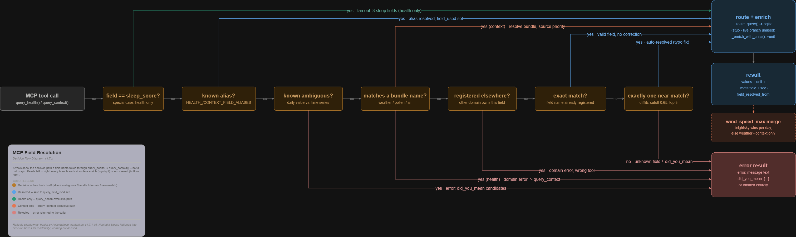

# Garmin Local Archive — MCP Server Reference

Technical reference for the MCP Server (`clients/mcp_server.py`,
`maps/mcp_map.py`) — the standalone MCP protocol layer that exposes
archived data to LLM clients. See `REFERENCE_BROKER.md` for the
underlying Broker Layer (`health_map`/`context_map`/`gateway_map`) this
server sits on top of, and `REFERENCE_GLOBAL.md` for shared paths,
constants, and project structure. Decision history, rejected
alternatives, and test-run numbers for the mechanisms below live in
`CHANGELOG.md`, not here.

---

## Scope

This file covers six modules:
- `maps/mcp_map.py` — thin protocol translation onto `gateway_map`.
- `clients/mcp_server.py` — MCP tool registration, transport, routing entry point.
- `clients/mcp_query_common.py` — shared query-serving helpers (`_route_query`, `_get_field_unit`, `_enrich_with_units`).
- `clients/mcp_field_registry.py` — the field-unit and alias/ambiguity registries.
- `clients/mcp_health.py` — `query_health()`.
- `clients/mcp_context.py` — `query_context()`, `_resolve_context_bundle()`, `_fetch_context_field()`.

---

## `mcp_map.py` — MCP protocol translation

```python
from maps.mcp_map import query_health, query_context, query_fit_activities, \
    query_raw, get_archive_metadata, list_available_fields
```

Thin delegation to `gateway_map.get()`/`get_raw()`/`get_metadata()` —
`mcp_map.py` owns no data, no state, no MCP-SDK dependency, and is fully
testable without a running MCP server (`tests/test_mcp.py`). Tool
granularity is domain-named, not a 1:1 wrapper around `gateway_map`
parameters — one function per domain (`query_health`/`query_context`/
`query_fit_activities`) rather than a single generic `query(domain=...)`,
so a domain typo is a Python-level caller error (wrong function name)
instead of a silent runtime string mismatch.

```python
query_health(field, date_from, date_to, resolution="daily") -> dict
# {"health": <gateway_map.get(..., domain="health")["health"]>, "_meta": {...}}

query_context(field, date_from, date_to, resolution="daily") -> dict
# {"context": <gateway_map.get(..., domain="context")["context"]>, "_meta": {...}}

query_fit_activities(field, date_from, date_to, resolution="daily") -> dict
# {"fit": <gateway_map.get(..., domain="fit")["fit"]>, "_meta": {...}}
# Until garmin_fit_map.py lands: {"fit": {"error": "domain not yet
# available"}, "_meta": {...}} — gateway_map's existing unregistered-domain
# handling, no FIT-specific code path here.

query_raw(field, date_from, date_to, domain=None) -> dict
# gateway_map.get_raw() result + "_meta" key added

get_archive_metadata(kind, date_from=None, date_to=None) -> dict
# gateway_map.get_metadata(kind, date_from, date_to) result, unchanged —
# no "_meta" weekday block (that concept is specific to the time-series
# query_*() functions above). date_from/date_to are a plain date-RANGE
# FILTER, not a time-series "resolution" — only five of the nine
# LLM-facing kinds honor them ("quality_log", "source_api_log",
# "daily_logs", "fail_logs", "recent_logs"); the other four ("stats",
# "device_table", "token_log", "capability_config") ignore both
# arguments. Omitting both on a filterable kind returns the last 30 days
# (anchored on the latest available date, not on today) plus a "note"
# field explaining that, on the live path only — see the SQLite-routing
# caveat under `clients/mcp_server.py` below.

list_available_fields(domain=None) -> dict
# {"domains": [...], "metadata_kinds": [...],
#  "fields": {"health": {...}, "context": {...}, "fit": []}}

# Internal sync use only, NOT registered as MCP tools in
# clients/mcp_server.py — clients/mcp_update.py is the only intended
# caller, an LLM has no use for a raw filename list. Same
# thin-delegation, no-"_meta"-block pattern as get_archive_metadata()
# above.
list_daily_log_filenames(date_from=None, date_to=None) -> dict
list_fail_log_filenames(date_from=None, date_to=None) -> dict
list_recent_log_filenames(date_from=None, date_to=None) -> dict
get_raw_file_hashes(date_from, date_to) -> dict
# gateway_map.get_metadata("raw_file_hashes", date_from, date_to)

list_raw_fields(domain=None) -> dict
# gateway_map.list_raw_fields(domain) — same shape as that function's
# own contract, passed through unchanged. Distinct from
# list_available_fields() above: that function's "fields" key never
# includes raw-passthrough fields at all ("fit" is always an empty list;
# raw-passthrough is a structurally separate registry — see
# REFERENCE_GARMIN.md, "Raw-passthrough fields").
```

**`_meta` block** — attached to every date-ranged query response
(`query_health`/`query_context`/`query_fit_activities`/`query_raw`), built
by `_build_meta(date_from, date_to)`:

```python
{
    "date_from_iso":      str,   # "2026-08-01"
    "date_from_readable": str,   # "August 01, 2026"
    "date_to_iso":         str,
    "date_to_readable":    str,
    "weekdays": {                # one entry per calendar day in range
        "2026-08-01": "Saturday",
        "2026-08-02": "Sunday",
        # ...
    },
}
```

One entry per calendar day, not per data point — at intraday resolution
the latter would repeat the same weekday string thousands of times.
Addresses a documented LLM failure mode (miscalculating weekdays from a
bare ISO date).

**Error behaviour** — identical principle to `gateway_map.py`, never
raises for data-availability reasons:
- Degraded `{"error": ...}` results from `gateway_map` are passed through
  unchanged, nested under the domain/result key — a normal successful
  return with an `error` field in the payload, not an exception.
- `gateway_map.get()`'s `ValueError` for a genuinely unknown domain string
  cannot occur via `query_health`/`query_context`/`query_fit_activities` —
  domain is fixed per function, not caller-supplied.
- `query_raw()` raises `ValueError` if `domain` is set to an unknown
  string — passed through unchanged from `gateway_map.get_raw()`.
- `get_archive_metadata()` raises `ValueError` if `kind` is not a known
  metadata kind — passed through unchanged from `gateway_map.get_metadata()`.

---

## `clients/mcp_server.py` — tool registration, routing, transport

Standalone MCP server process (`mcp>=1.28,<2`), streamable-http
transport. Registers **seven MCP tools**:

- Five defined directly here, as thin `@mcp.tool()` wrappers with no
  broker/delegation logic of their own: `query_fit_activities`,
  `query_raw`, `get_archive_metadata`, `list_available_fields`,
  `refresh_cache`.
- Two, `query_health` and `query_context`, live in their own files
  (`clients/mcp_health.py` / `clients/mcp_context.py`) and are imported
  here, then registered programmatically —
  `query_health = mcp.tool()(query_health)` — rather than with
  `@mcp.tool()` at the definition site, since the shared `mcp` `FastMCP`
  instance lives in this module and importing it into those two files
  would be circular.

The three `list_*_log_filenames()` functions plus `get_raw_file_hashes()`/
`list_raw_fields()` (see `mcp_map.py` above) are **not** part of either
group — exposed for `clients/mcp_update.py`'s own internal use, never
registered as MCP tools.

**Error handling:** no translation code. `mcp_map.py`'s degraded results
(`{"error": ...}` inside an otherwise normal return dict) pass through
unchanged as ordinary tool payloads (`isError` stays `False`). Genuine
exceptions (the two `ValueError` cases above) are left unhandled by
design — the MCP SDK automatically converts any uncaught exception
raised inside a `@mcp.tool()`-decorated function into
`CallToolResult(isError=True, ...)` with `str(exception)` as the message.

**Transport:** `mcp.run(transport="streamable-http")`. Host is
hardcoded `"127.0.0.1"` — not configurable, a deliberate security
boundary. Port is `garmin_config.MCP_HTTP_PORT` (ENV > config file >
default `8756`). An opt-in `MCP_EXTRA_ALLOWED_HOSTS_ENABLED` flag adds
extra DNS-rebinding-check allowed hosts/origins on top of the SDK's own
`127.0.0.1`/`localhost`/`::1` defaults — needed for an MCP client
(e.g. Open WebUI) running in Docker, reachable only via
`host.docker.internal`. This does not change the bind address; it only
widens which incoming `Host`/`Origin` headers are accepted.

**Routing weiche (`_route_query()`, in `clients/mcp_query_common.py`):**
all query tools except `refresh_cache()` (a sync trigger, not a data
query) call this before delegating. **Currently a placeholder — always
returns `"sqlite"`**, no real cost/staleness heuristic yet. The
`"sqlite"` branch calls the matching `clients/mcp_sql.py` cache-read
function instead of the `mcp_map.py` functions above; the live branch
is reachable today only by changing this one function. `query_fit_activities`
and `list_available_fields` route through the same decision point, but
both branches currently call the identical function (no cache benefit
for a not-yet-existing FIT domain, or for a code-registry read) — this
file's `mcp_map.py` contract remains the authoritative description of
what each tool *returns*; the weiche only changes *which module supplies
it*.

**`refresh_cache()`:** manually triggers the same SQLite sync the server
already runs once at startup (`clients/mcp_update.py::sync_all()`).
Blocks until the sync finishes. **(v1.7.2.3)** This is also the only way
a context-archive repair (`context/context_silo_repair.py`) becomes
visible to `query_context()` before the server's next restart — `sync_all()`
consumes the pending-resync marker and invalidates the affected SQLite
rows (`mcp_sql.invalidate_context_day()`) as part of the same run. See
`clients/mcp_update.py`'s entry in `REFERENCE_GLOBAL.md`'s Module
reference table for the mechanism, `REFERENCE_CONTEXT.md` for the
archive-repair side.

**Practical consequence of the routing weiche always being `"sqlite"`
(v1.7.2.3 finding):** because the live branch below is unreachable
today, `query_context()` always reads `mcp_sql.get_context_range()`,
which reads `payload_json` directly — with no reference at all to
`complete_sources`/`attempted_sources`. A day whose pending-resync entry
has not yet been synced therefore genuinely has no fresher value to
fall back to; `invalidate_context_day()` clearing that day's
`payload_json` (not just the bookkeeping sets) is what keeps such a
query from returning a stale, already-known-wrong value instead of "no
data" during that window.

**Startup:** windowed by default (the app window owns the server
process — closing the window closes the server); `garmin_config.MCP_HEADLESS`
switches to a no-window, direct-blocking mode. A SQLite proxy boot sync
runs once, synchronously, before either startup path starts serving
requests.

---

## `clients/mcp_query_common.py` — shared query-serving helpers

Three helpers with no dependency on `mcp`/`mcp_sql`/`mcp_map`, needed by
both `mcp_server.py`'s four directly-defined query tools and by
`mcp_health.py`/`mcp_context.py` (which cannot import them back from
`mcp_server.py` without a circular import, since `query_health`/
`query_context` are registered from there).

- **`_route_query(kind)`** — the routing weiche described above.
- **`_get_field_unit(field)`** — single lookup point into `FIELD_UNITS`
  (`clients/mcp_field_registry.py`); unknown field → `"—"` rather than a
  `KeyError`.
- **`_enrich_with_units(result, domain)`** — adds a `"unit"` key to every
  per-field dict inside `result[domain]`, in place, handling both the
  normal per-source shape (`{source: {field: {...}}}`) and the
  already-flattened shape (`{field: {...}}`, e.g. a resolved bundle).
  Also sets `_meta["has_data"] = False` whenever every `"values"` array
  it finds is empty (or the domain dict itself is empty) — reuses the
  same per-field pass already needed for the unit lookup, so a
  resolved-but-no-data response is distinguishable from an
  in-progress/incomplete one.

---

## `clients/mcp_field_registry.py` — field registry

Pure data, no logic — five registries. Exact current contents (counts,
which fields) are not repeated below by design — treat the source file
itself as authoritative; a hardcoded count here is exactly the kind of
detail that goes stale the next time a field is added.

- **`FIELD_UNITS`** — `{field_name: unit_string}`, one entry per
  queryable field across Health and Context, including fields with no
  physical unit (e.g. `"—"`, `"text"`, `"index"`) — deliberately no
  missing keys, so a mixed state (some fields with a unit, some without)
  never becomes its own source of LLM misinterpretation. Deliberately
  kept MCP-local rather than moved into `health_map.py`/`context_map.py`/
  `gateway_map.py` (see the module's own header comment for the
  reasoning) — isolated behind `_get_field_unit()` so a future
  broker-level replacement only needs to change that one function.
  Raw-passthrough fields (`query_raw()`) are out of scope — no unit
  concept applies to them.
- **`HEALTH_FIELD_ALIASES`** — explicit short-form → canonical-name map
  for `query_health()` (currently `hrv`, `hill`), for prefixes too short
  relative to their target name for `difflib` to resolve reliably at any
  workable cutoff. Checked before the near-match step — an alias hit is
  more certain than a fuzzy match.
- **`HEALTH_FIELD_AMBIGUOUS`** — fields where the requested name does not
  reveal whether a daily value or a `_series` (timeseries) was meant
  (currently `spo2`, `stress`, `steps`) — **not** resolved; returns an
  `error` + `did_you_mean` listing both candidates, since no reliable
  signal exists to pick one over the other (`resolution` is accepted by
  `query_health()` but not currently used to disambiguate).
- **`CONTEXT_FIELD_ALIASES`** — the `query_context()` equivalent of
  `HEALTH_FIELD_ALIASES`: a larger, curated set of short/decorated/
  German-language/misspelled request forms mapped to their canonical
  field name (e.g. `humidity` → `humidity_avg`, `no2_avg` →
  `airquality_nitrogen_dioxide`, `ozon` → `airquality_ozone`).
- **`CONTEXT_FIELD_AMBIGUOUS`** — the `query_context()` equivalent of
  `HEALTH_FIELD_AMBIGUOUS`: fields where daily-vs-series is not
  recoverable from the requested name (currently `pm25`, `pm2_5`,
  `pm10`, `no2`, `air_quality_index`, `ozone`).
- **`_CONTEXT_CATEGORY_BUNDLES`** — maps a category name (`"weather"`,
  `"pollen"`, `"air"`) to a **priority-ordered** list of `context_map`
  source names (currently `"weather": ["brightsky", "weather"]`,
  `"pollen": ["pollen"]`, `"air": ["airquality"]`). Field names per
  source are resolved at call time via
  `mcp_map.list_available_fields(domain="context")`, not hardcoded here
  — a source's own field additions need no change to this table. Order
  is the tie-break priority for a same-named field registered by more
  than one source in the same bundle (see "Bundle resolution" under
  `clients/mcp_context.py` below).

---

## Field-name resolution (`query_health()` / `query_context()`)

Both tools resolve the caller's `field` argument through the same
decision order before ever touching the archive — the mechanism that
decides *which field is the right one* when the caller's input is not
an exact, registered name. Diagram (reads left to right):



Checked in this order, first match wins:

1. **Health-only exact special case** — `field == "sleep_score"` in
   `query_health()` fans out into three separate queries
   (`sleep_score`, `sleep_score_feedback`, `sleep_score_qualifier`) and
   merges them into one flattened result. `_meta.field_resolved_from`
   is set to `"sleep_score"`; no `field_used`, since all three delivered
   names are already the result's own keys.
2. **Known alias** — `HEALTH_FIELD_ALIASES` / `CONTEXT_FIELD_ALIASES` hit
   → resolved transparently, `_meta.field_used` / `field_resolved_from`
   set.
3. **Known ambiguous** — `HEALTH_FIELD_AMBIGUOUS` / `CONTEXT_FIELD_AMBIGUOUS`
   hit → **not** resolved; `error` + `did_you_mean` naming both
   candidates, caller must re-ask with the exact name.
4. **Category bundle name** (`"weather"`/`"pollen"`/`"air"`) — in
   `query_context()`, resolved via `_resolve_context_bundle()` (see
   below). In `query_health()`, a bundle name is never a valid health
   field, so this is a domain error (outcome 6).
5. **Registered under the other domain** — an exact, registered field
   of the OTHER tool's domain returns a domain error naming the correct
   tool, with no `did_you_mean` (checked *before* the near-match step,
   so an exact cross-domain field is never claimed by a fuzzy match
   first).
6. **Exact match in this domain** — already a registered field name,
   queried directly, no correction needed.
7. **Exactly one `difflib` near-match** (`cutoff=0.65`, top 3 candidates)
   against this domain's field registry → auto-resolved, `_meta.field_used`
   / `field_resolved_from` set. More than one candidate, or none →
   generic `error: unknown field`, with `did_you_mean` when `difflib`
   found any candidates at all.

A valid field's result (with or without data in the requested range) is
returned exactly as any of the above would leave it once resolved —
none of this runs for a field that was already exact and registered.

---

## `clients/mcp_health.py` — `query_health()`

Implements the Health side of the decision order above, plus the
`sleep_score` fan-out (step 1) described there. Routes through
`_route_query("health")` / `_enrich_with_units(result, "health")` like
every other query tool — no bypass data-access path.

---

## `clients/mcp_context.py` — `query_context()`

Implements the Context side of the decision order above, plus two
Context-only mechanisms:

**Bundle resolution (`_resolve_context_bundle()`):** flattens a
category name into one value per field name across all sources in that
bundle. The one naming collision in the current registry between
distinct sources, `wind_speed_max` (registered by both `weather` and
`brightsky`, Modell vs. Messstation), is resolved **per day, not per
whole field**: for each date in range, the first source in the bundle's
priority list with a non-`None` value for that day wins — a field's
final `values` array can be stitched together from more than one source
across a range. The winning source per collision-day is recorded in
`_meta.field_sources`. `_series` (intraday) fields are skipped during
bundle collection — the bundle mechanism answers a daily-value
source-collision question, and none of the three affected sources ever
has more than one intraday candidate for the same field; a `_series`
field stays individually queryable via `query_context()` outside the
bundle path.

**`wind_speed_max` merge (`_fetch_context_field()`):** the same
`brightsky`-wins-per-day-else-`weather` tie-break applies no matter how
the request reaches `wind_speed_max` — a direct field request, a
`CONTEXT_FIELD_ALIASES` hit, or a `difflib` near-match all go through
this one shared helper, so the merge is never skipped depending on
resolution path.
